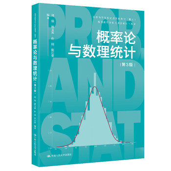
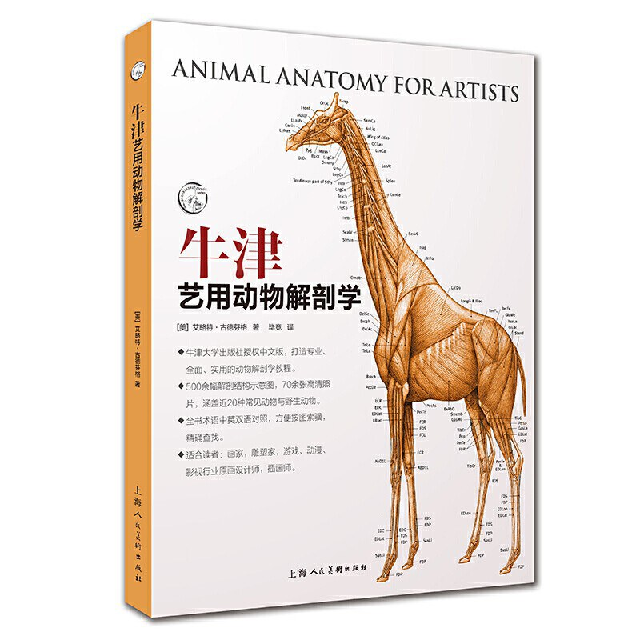
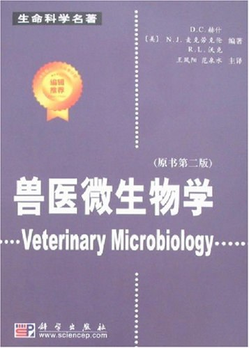

# 华中农业大学本科课程按学期整理（2025版培养方案）

> 格式：学院 → 专业（25级）→ 第X学期：课程 + 教材封面。封面图来自 `covers/` 目录。

## 动物科学技术学院、动物医学院

### 动物医学（25级）

**第1学期**

- **中国近现代史纲要** — 《中国近现代史纲要（2023年版）》（ISBN: ，封面待补）
- **军事技能** — 《军事训练教程》（ISBN: ，封面待补）
- **微积分C** — 《高等数学（第七版·上/下册）》（ISBN: ，封面待补）
- **有机化学B** — 《有机化学（农科类 第三版）》（ISBN: ，封面待补）
- 工程基础
- **军事理论** — 《军事理论课教程》（ISBN: ，封面待补）
- **写作与沟通** — 《写作与沟通》（ISBN: ，封面待补）
- **形势与政策（一）** — 《形势与政策（最新版）》（ISBN: ，封面待补）
- **大学生创新创业基础** — 《大学生创新创业基础》（ISBN: ，封面待补）
- **外语类课程** — 《新视野大学英语（第三版·读写教程）》（ISBN: ，封面待补）
- **体育类课程** — 《大学体育（教材）》（ISBN: ，封面待补）

**第2学期**

- **思想道德与法治** — 《思想道德与法治（2023年版）》（ISBN: ，封面待补）
- **概率论与数理统计B** — 《概率论与数理统计（第五版）》（ISBN: 9787040384876）
  
- **线性代数B** — 《线性代数（第六版）》（ISBN: 9787040396632）
  
- **无机及分析化学B** — 《无机及分析化学（第五版）》（ISBN: ，封面待补）
- **动物解剖学** — 《动物解剖学（第4版）》（ISBN: 9787040613728）
  
- **人工智能应用基础** — 《人工智能基础（通识）》（ISBN: ，封面待补）
- **大学生心理发展与指导** — 《大学生心理健康教育》（ISBN: ，封面待补）
- **外语类课程** — 《新视野大学英语（第三版·读写教程）》（ISBN: ，封面待补）
- **体育类课程** — 《大学体育（教材）》（ISBN: ，封面待补）

**第3学期**

- **大学物理C** — 《物理学（第七版）》（ISBN: 9787571720）
  
- **毛泽东思想和中国特色3社会主义理论体系概论** — 《毛泽东思想和中国特色社会主义理论体系概论（2023年版）》（ISBN: ，封面待补）
- **习近平新时代中国特色3社会主义思想概论** — 《习近平新时代中国特色社会主义思想概论（2023年版）》（ISBN: ，封面待补）
- **动物组织胚胎学** — 《动物组织学及胚胎学（第4版）》（ISBN: ，封面待补）
- **动物生物化学** — 《动物生物化学（第6版）》（ISBN: ，封面待补）
- **外语类课程** — 《新视野大学英语（第三版·读写教程）》（ISBN: ，封面待补）
- **体育类课程** — 《大学体育（教材）》（ISBN: ，封面待补）

**第4学期**

- **马克思主义基本原理** — 《马克思主义基本原理（2023年版）》（ISBN: ，封面待补）
- **动物生理学** — 《动物生理学（第4版）》（ISBN: ，封面待补）
- **兽医公共卫生学** — 《兽医公共卫生学（第3版）》（ISBN: ，封面待补）
- **兽医免疫学** — 《兽医免疫学（第3版）》（ISBN: ，封面待补）
- **外语类课程** — 《新视野大学英语（第三版·读写教程）》（ISBN: ，封面待补）
- **体育类课程** — 《大学体育（教材）》（ISBN: ，封面待补）

**第5学期**

- 兽医药理学A
- **兽医临床诊断学** — 《兽医临床诊断学（第4版）》（ISBN: ，封面待补）
- **兽医微生物学** — 《兽医微生物学（第6版）》（ISBN: 9787109284432）
  
- 智慧兽医

**第6学期**

- **兽医病理学** — 《兽医病理学（第4版）》（ISBN: ，封面待补）
- **兽医外科手术学** — 《兽医外科手术学（第4版）》（ISBN: ，封面待补）
- **中兽医学** — 《中兽医学（第4版）》（ISBN: ，封面待补）

**第7学期**

- **兽医内科学** — 《兽医内科学（第3版）》（ISBN: ，封面待补）
- **动物传染病学** — 《动物传染病学（第4版）》（ISBN: ，封面待补）
- **兽医外科学** — 《兽医外科学（第4版）》（ISBN: ，封面待补）
- **兽医寄生虫病学** — 《兽医寄生虫病学（第4版）》（ISBN: ，封面待补）

**第8学期**

- **兽医产科学** — 《兽医产科学（第4版）》（ISBN: ，封面待补）
- **形势与政策（二）** — 《形势与政策（最新版）》（ISBN: ，封面待补）

### 动物科学（25级）

**第1学期**

- **中国近现代史纲要** — 《中国近现代史纲要（2023年版）》（ISBN: ，封面待补）
- **军事技能** — 《军事训练教程》（ISBN: ，封面待补）
- **微积分C** — 《高等数学（第七版·上/下册）》（ISBN: ，封面待补）
- **有机化学B** — 《有机化学（农科类 第三版）》（ISBN: ，封面待补）
- 工程基础
- **军事理论** — 《军事理论课教程》（ISBN: ，封面待补）
- **形势与政策（一）** — 《形势与政策（最新版）》（ISBN: ，封面待补）
- **写作与沟通** — 《写作与沟通》（ISBN: ，封面待补）
- **大学生创新创业基础** — 《大学生创新创业基础》（ISBN: ，封面待补）
- **外语类课程** — 《新视野大学英语（第三版·读写教程）》（ISBN: ，封面待补）
- **体育类课程** — 《大学体育（教材）》（ISBN: ，封面待补）

**第2学期**

- **思想道德与法治** — 《思想道德与法治（2023年版）》（ISBN: ，封面待补）
- **概率论与数理统计B** — 《概率论与数理统计（第五版）》（ISBN: 9787040384876）
  
- **线性代数B** — 《线性代数（第六版）》（ISBN: 9787040396632）
  
- **无机及分析化学B** — 《无机及分析化学（第五版）》（ISBN: ，封面待补）
- **动物解剖学** — 《动物解剖学（第4版）》（ISBN: 9787040613728）
  
- **人工智能应用基础** — 《人工智能基础（通识）》（ISBN: ，封面待补）
- **大学生心理发展与指导** — 《大学生心理健康教育》（ISBN: ，封面待补）
- **外语类课程** — 《新视野大学英语（第三版·读写教程）》（ISBN: ，封面待补）
- **体育类课程** — 《大学体育（教材）》（ISBN: ，封面待补）

**第3学期**

- **大学物理C** — 《物理学（第七版）》（ISBN: 9787571720）
  
- **毛泽东思想和中国特色3社会主义理论体系概论** — 《毛泽东思想和中国特色社会主义理论体系概论（2023年版）》（ISBN: ，封面待补）
- **习近平新时代中国特色3社会主义思想概论** — 《习近平新时代中国特色社会主义思想概论（2023年版）》（ISBN: ，封面待补）
- **动物组织胚胎学** — 《动物组织学及胚胎学（第4版）》（ISBN: ，封面待补）
- **动物生物化学** — 《动物生物化学（第6版）》（ISBN: ，封面待补）
- **外语类课程** — 《新视野大学英语（第三版·读写教程）》（ISBN: ，封面待补）
- **体育类课程** — 《大学体育（教材）》（ISBN: ，封面待补）

**第4学期**

- **马克思主义基本原理概论** — 《马克思主义基本原理（2023年版）》（ISBN: ，封面待补）
- **动物生理学** — 《动物生理学（第4版）》（ISBN: ，封面待补）
- **普通遗传学** — 《动物遗传学（第4版）》（ISBN: ，封面待补）
- **外语类课程** — 《新视野大学英语（第三版·读写教程）》（ISBN: ，封面待补）
- **体育类课程** — 《大学体育（教材）》（ISBN: ，封面待补）

**第5学期**

- **家畜育种学** — 《家畜育种学（第3版）》（ISBN: ，封面待补）
- **动物繁殖学** — 《动物繁殖学（第5版）》（ISBN: ，封面待补）
- **动物营养与饲料学** — 《动物营养学（第4版）》（ISBN: ，封面待补）
- **饲料分析与动物营养研究技术** — 《饲料分析及饲料质量检测技术（第4版）》（ISBN: ，封面待补）
- 智能畜禽表型大数据分析

**第6学期**

- 智慧动物生产学

**第7学期**

- **形势与政策（二）** — 《形势与政策（最新版）》（ISBN: ，封面待补）

**第8学期**

- **体育类课程必修，实行选项制，一、二年级要求每学期修满1** — 《大学体育（教材）》（ISBN: ，封面待补）
- **体育类课程教学详见《华中农业大学体育教学改革实施方案》。** — 《大学体育（教材）》（ISBN: ，封面待补）

## 水产学院

### 水产养殖学（25级）

**第1学期**

- **中国近现代史纲要** — 《中国近现代史纲要（2023年版）》（ISBN: ，封面待补）
- **大学英语（3）2B级学生修读** — 《新视野大学英语（第三版·读写教程）》（ISBN: ，封面待补）
- **大学英语（4）2A级学生修读** — 《新视野大学英语（第三版·读写教程）》（ISBN: ，封面待补）
- **体育类课程** — 《大学体育（教材）》（ISBN: ，封面待补）
- **军事技能2军事训练3周** — 《军事训练教程》（ISBN: ，封面待补）
- **微积分C** — 《高等数学（第七版·上/下册）》（ISBN: ，封面待补）
- **有机化学B** — 《有机化学（农科类 第三版）》（ISBN: ，封面待补）
- 水产学科专业导论
- **大学生心理素质拓展** — 《大学生心理健康教育》（ISBN: ，封面待补）
- **写作与沟通** — 《写作与沟通》（ISBN: ，封面待补）
- **大学生心理发展与指导** — 《大学生心理健康教育》（ISBN: ，封面待补）
- **形势与政策（一）** — 《形势与政策（最新版）》（ISBN: ，封面待补）

**第2学期**

- **思想道德与法治** — 《思想道德与法治（2023年版）》（ISBN: ，封面待补）
- 中级英语视听说2B级学生修读
- 高级英语视听说2A级学生修读
- **体育类课程** — 《大学体育（教材）》（ISBN: ，封面待补）
- **概率论** — 《概率论与数理统计（第五版）》（ISBN: 9787040384876）
  
- **线性代数B** — 《线性代数（第六版）》（ISBN: 9787040396632）
  
- **无机及分析化学B** — 《无机及分析化学（第五版）》（ISBN: ，封面待补）
- **军事理论** — 《军事理论课教程》（ISBN: ，封面待补）
- **人工智能应用基础** — 《人工智能基础（通识）》（ISBN: ，封面待补）
- **大学生创新创业基础** — 《大学生创新创业基础》（ISBN: ，封面待补）
- **动物学** — 《动物学（第二版）》（ISBN: ，封面待补）

**第3学期**

- **外语类课程** — 《新视野大学英语（第三版·读写教程）》（ISBN: ，封面待补）
- **大学物理学C** — 《物理学（第七版）》（ISBN: 9787571720）
  
- 生物化学D
- **鱼类学** — 《鱼类学（第二版）》（ISBN: ，封面待补）
- **体育类课程** — 《大学体育（教材）》（ISBN: ，封面待补）
- **组织胚胎学** — 《动物组织学及胚胎学（第4版）》（ISBN: ，封面待补）
- **细胞生物学** — 《细胞生物学（第4版）》（ISBN: ，封面待补）
- 农业政策学
- 物流与供应链管理
- 质量管理

**第4学期**

- **马克思主义基本原理** — 《马克思主义基本原理（2023年版）》（ISBN: ，封面待补）
- **外语类课程** — 《新视野大学英语（第三版·读写教程）》（ISBN: ，封面待补）
- 科研训练12周
- **水生生物学** — 《水生生物学》（ISBN: ，封面待补）
- **水环境化学** — 《水环境化学》（ISBN: ，封面待补）
- **水产动物遗传育种学** — 《水产动物育种学》（ISBN: ，封面待补）
- 渔业资源与渔业环境调查12周，第二学年暑期
- **体育类课程** — 《大学体育（教材）》（ISBN: ，封面待补）
- 农业经济学
- 食物经济学

**第5学期**

- **动物生理学** — 《动物生理学（第4版）》（ISBN: ，封面待补）
- **水产动物营养与饲料学** — 《水产动物营养与饲料学》（ISBN: ，封面待补）
- **水域生态学** — 《水域生态学》（ISBN: ，封面待补）
- 水产微生物技术应用
- 鱼类行为学
- **水产品保鲜与加工** — 《水产品加工工艺学》（ISBN: ，封面待补）

**第6学期**

- **水产动物疾病学** — 《水产动物疾病学》（ISBN: ，封面待补）
- **生物统计** — 《生物统计附试验设计（第5版）》（ISBN: ，封面待补）
- 智慧水产养殖学
- **水产药物学** — 《水产药物学》（ISBN: ，封面待补）
- 鱼类摄食与添加剂
- 水产品品质与卫生检验
- **饲料加工工艺学** — 《饲料加工工艺学》（ISBN: ，封面待补）

**第7学期**

- 休闲渔业
- 学术阅读与写作
- 大水面渔业

**第8学期**

- **形势与政策（二）** — 《形势与政策（最新版）》（ISBN: ，封面待补）
- **体育类课程必修，实行选项制，一、二年级要求每学期修满1** — 《大学体育（教材）》（ISBN: ，封面待补）
- **体育类课程教学详见《华中农业大学体育教学改革实施方案》。** — 《大学体育（教材）》（ISBN: ，封面待补）

### 水族科学与技术（25级）

**第1学期**

- **中国近现代史纲要** — 《中国近现代史纲要（2023年版）》（ISBN: ，封面待补）
- **大学英语（3）2B级学生修读** — 《新视野大学英语（第三版·读写教程）》（ISBN: ，封面待补）
- **大学英语（4）2A级学生修读** — 《新视野大学英语（第三版·读写教程）》（ISBN: ，封面待补）
- **体育类课程** — 《大学体育（教材）》（ISBN: ，封面待补）
- **军事技能2军事训练3周** — 《军事训练教程》（ISBN: ，封面待补）
- **微积分C** — 《高等数学（第七版·上/下册）》（ISBN: ，封面待补）
- **有机化学B** — 《有机化学（农科类 第三版）》（ISBN: ，封面待补）
- 水产学科专业导论
- **大学生心理素质拓展** — 《大学生心理健康教育》（ISBN: ，封面待补）
- **写作与沟通** — 《写作与沟通》（ISBN: ，封面待补）
- **大学生心理发展与指导** — 《大学生心理健康教育》（ISBN: ，封面待补）
- **形势与政策（一）** — 《形势与政策（最新版）》（ISBN: ，封面待补）

**第2学期**

- **思想道德与法治** — 《思想道德与法治（2023年版）》（ISBN: ，封面待补）
- 中级英语视听说2B级学生修读
- 高级英语视听说2A级学生修读
- **体育类课程** — 《大学体育（教材）》（ISBN: ，封面待补）
- **概率论** — 《概率论与数理统计（第五版）》（ISBN: 9787040384876）
  
- **线性代数B** — 《线性代数（第六版）》（ISBN: 9787040396632）
  
- **无机及分析化学B** — 《无机及分析化学（第五版）》（ISBN: ，封面待补）
- **军事理论** — 《军事理论课教程》（ISBN: ，封面待补）
- **人工智能应用基础** — 《人工智能基础（通识）》（ISBN: ，封面待补）
- **大学生创新创业基础** — 《大学生创新创业基础》（ISBN: ，封面待补）
- **动物学** — 《动物学（第二版）》（ISBN: ，封面待补）

**第3学期**

- **外语类课程** — 《新视野大学英语（第三版·读写教程）》（ISBN: ，封面待补）
- **大学物理学C** — 《物理学（第七版）》（ISBN: 9787571720）
  
- 生物化学D
- **鱼类学** — 《鱼类学（第二版）》（ISBN: ，封面待补）
- **体育类课程** — 《大学体育（教材）》（ISBN: ，封面待补）
- **组织胚胎学** — 《动物组织学及胚胎学（第4版）》（ISBN: ，封面待补）
- **细胞生物学** — 《细胞生物学（第4版）》（ISBN: ，封面待补）

**第4学期**

- **马克思主义基本原理概论** — 《马克思主义基本原理（2023年版）》（ISBN: ，封面待补）
- 科研训练
- **水生生物学** — 《水生生物学》（ISBN: ，封面待补）
- **水环境化学** — 《水环境化学》（ISBN: ，封面待补）
- 水族观赏植物栽培学
- **体育类课程** — 《大学体育（教材）》（ISBN: ，封面待补）
- 农业企业经营管理学

**第5学期**

- **动物生理学** — 《动物生理学（第4版）》（ISBN: ，封面待补）
- **水族观赏动物养殖学** — 《观赏鱼类养殖学》（ISBN: ，封面待补）
- **水族观赏动物遗传育种学** — 《水产动物育种学》（ISBN: ，封面待补）
- 世界水族（全英文课程）
- **水域生态学** — 《水域生态学》（ISBN: ，封面待补）
- 水环境保护
- 水生动物免疫学
- 水产微生物技术应用
- 农业政策学

**第6学期**

- **生物统计** — 《生物统计附试验设计（第5版）》（ISBN: ，封面待补）
- **水族动物疾病学** — 《水产动物疾病学》（ISBN: ，封面待补）
- **水产药物学** — 《水产药物学》（ISBN: ，封面待补）
- **名特水产动物养殖** — 《名特水产养殖学》（ISBN: ，封面待补）
- 智慧水产养殖学
- 食物经济学
- 期货市场理论与实务

**第7学期**

- 水生生物科学进展
- 学术阅读与写作
- 休闲渔业
- 智慧农业研究进展

**第8学期**

- **形势与政策（二）** — 《形势与政策（最新版）》（ISBN: ，封面待补）

## 植物科学技术学院

### 农学（25级）

**第1学期**

- 植物生产类专业导论
- **中国近现代史纲要** — 《中国近现代史纲要（2023年版）》（ISBN: ，封面待补）
- **微积分C** — 《高等数学（第七版·上/下册）》（ISBN: ，封面待补）
- **无机及分析化学C** — 《无机及分析化学（第五版）》（ISBN: ，封面待补）
- **军事理论** — 《军事理论课教程》（ISBN: ，封面待补）
- **军事技能** — 《军事训练教程》（ISBN: ，封面待补）
- **写作与沟通** — 《写作与沟通》（ISBN: ，封面待补）
- **大学生创新创业基础** — 《大学生创新创业基础》（ISBN: ，封面待补）
- **外语类课程** — 《新视野大学英语（第三版·读写教程）》（ISBN: ，封面待补）
- **体育类课程** — 《大学体育（教材）》（ISBN: ，封面待补）

**第2学期**

- **思想道德与法治** — 《思想道德与法治（2023年版）》（ISBN: ，封面待补）
- **概率论** — 《概率论与数理统计（第五版）》（ISBN: 9787040384876）
  
- **线性代数A** — 《线性代数（第六版）》（ISBN: 9787040396632）
  
- **大学物理C** — 《物理学（第七版）》（ISBN: 9787571720）
  
- **有机化学B** — 《有机化学（农科类 第三版）》（ISBN: ，封面待补）
- 植物学
- **大学生心理发展与指导** — 《大学生心理健康教育》（ISBN: ，封面待补）
- **大学生心理素质拓展** — 《大学生心理健康教育》（ISBN: ，封面待补）
- **形势与政策（一）** — 《形势与政策（最新版）》（ISBN: ，封面待补）
- **人工智能应用基础** — 《人工智能基础（通识）》（ISBN: ，封面待补）
- **外语类课程** — 《新视野大学英语（第三版·读写教程）》（ISBN: ，封面待补）
- **体育类课程** — 《大学体育（教材）》（ISBN: ，封面待补）

**第3学期**

- 生物化学B
- 遗传学B
- 微生物学B
- **外语类课程** — 《新视野大学英语（第三版·读写教程）》（ISBN: ，封面待补）
- **体育类课程** — 《大学体育（教材）》（ISBN: ，封面待补）

**第4学期**

- **马克思主义基本原理** — 《马克思主义基本原理（2023年版）》（ISBN: ，封面待补）
- 植物生理学A
- **外语类课程** — 《新视野大学英语（第三版·读写教程）》（ISBN: ，封面待补）
- **体育类课程** — 《大学体育（教材）》（ISBN: ，封面待补）

**第5学期**

- 作物栽培学A
- 作物育种学A
- 土壤肥料学B

**第6学期**

- 耕作学
- 植物保护通论A
- 智慧农作前沿专题

**第8学期**

- **形势与政策（二）** — 《形势与政策（最新版）》（ISBN: ，封面待补）
- **体育类课程必修，实行选项制，一、二年级要求每学期修满1** — 《大学体育（教材）》（ISBN: ，封面待补）
- **体育类课程教学详见《华中农业大学体育教学改革实施方案》。** — 《大学体育（教材）》（ISBN: ，封面待补）

### 应用生物科学（25级）

**第1学期**

- 植物生产类专业导论
- **中国近现代史纲要** — 《中国近现代史纲要（2023年版）》（ISBN: ，封面待补）
- **微积分C** — 《高等数学（第七版·上/下册）》（ISBN: ，封面待补）
- **无机及分析化学C** — 《无机及分析化学（第五版）》（ISBN: ，封面待补）
- **军事理论** — 《军事理论课教程》（ISBN: ，封面待补）
- **军事技能** — 《军事训练教程》（ISBN: ，封面待补）
- **写作与沟通** — 《写作与沟通》（ISBN: ，封面待补）
- **大学生创新创业基础** — 《大学生创新创业基础》（ISBN: ，封面待补）
- **外语类课程** — 《新视野大学英语（第三版·读写教程）》（ISBN: ，封面待补）
- **体育类课程** — 《大学体育（教材）》（ISBN: ，封面待补）

**第2学期**

- **思想道德与法治** — 《思想道德与法治（2023年版）》（ISBN: ，封面待补）
- **概率论** — 《概率论与数理统计（第五版）》（ISBN: 9787040384876）
  
- **线性代数A** — 《线性代数（第六版）》（ISBN: 9787040396632）
  
- **有机化学B** — 《有机化学（农科类 第三版）》（ISBN: ，封面待补）
- 植物学
- **大学物理C** — 《物理学（第七版）》（ISBN: 9787571720）
  
- **大学生心理发展与指导** — 《大学生心理健康教育》（ISBN: ，封面待补）
- **大学生心理素质拓展** — 《大学生心理健康教育》（ISBN: ，封面待补）
- **形势与政策（一）** — 《形势与政策（最新版）》（ISBN: ，封面待补）
- **人工智能应用基础** — 《人工智能基础（通识）》（ISBN: ，封面待补）
- **外语类课程** — 《新视野大学英语（第三版·读写教程）》（ISBN: ，封面待补）
- **体育类课程** — 《大学体育（教材）》（ISBN: ，封面待补）

**第3学期**

- 生物化学B
- 遗传学B
- 微生物学B
- **外语类课程** — 《新视野大学英语（第三版·读写教程）》（ISBN: ，封面待补）
- **体育类课程** — 《大学体育（教材）》（ISBN: ，封面待补）

**第4学期**

- **马克思主义基本原理** — 《马克思主义基本原理（2023年版）》（ISBN: ，封面待补）
- 植物生理学
- **动物学** — 《动物学（第二版）》（ISBN: ，封面待补）
- 植物生产类专业导论II
- 生物资源调查24-5学期进行
- 智慧植保应用专题
- **外语类课程** — 《新视野大学英语（第三版·读写教程）》（ISBN: ，封面待补）
- **体育类课程** — 《大学体育（教材）》（ISBN: ，封面待补）

**第5学期**

- 现代仪器分析
- 发酵工程原理与技术
- 基础生态学
- 分子生物学C

**第6学期**

- 基因工程
- 天然产物化学
- 植物生产与保护
- 生物资源学

**第7学期**

- 生物信息学

**第8学期**

- **形势与政策（二）** — 《形势与政策（最新版）》（ISBN: ，封面待补）
- **体育类课程≥4** — 《大学体育（教材）》（ISBN: ，封面待补）

### 智慧农业（25级）

**第1学期**

- **中国近现代史纲要** — 《中国近现代史纲要（2023年版）》（ISBN: ，封面待补）
- **形势与政策（一）** — 《形势与政策（最新版）》（ISBN: ，封面待补）
- 大学数学（1）
- 大学化学
- **军事技能** — 《军事训练教程》（ISBN: ，封面待补）
- **写作与沟通** — 《写作与沟通》（ISBN: ，封面待补）
- 智慧农业专业导论
- **外语类课程** — 《新视野大学英语（第三版·读写教程）》（ISBN: ，封面待补）
- **体育类课程** — 《大学体育（教材）》（ISBN: ，封面待补）

**第2学期**

- **思想道德与法治** — 《思想道德与法治（2023年版）》（ISBN: ，封面待补）
- 大学数学（2）
- **大学物理C** — 《物理学（第七版）》（ISBN: 9787571720）
  
- **大学生心理素质拓展** — 《大学生心理健康教育》（ISBN: ，封面待补）
- **大学生心理发展与指导** — 《大学生心理健康教育》（ISBN: ，封面待补）
- **形势与政策（一）** — 《形势与政策（最新版）》（ISBN: ，封面待补）
- **外语类课程** — 《新视野大学英语（第三版·读写教程）》（ISBN: ，封面待补）
- **体育类课程** — 《大学体育（教材）》（ISBN: ，封面待补）

**第3学期**

- 现代遗传学
- 生物化学C
- **外语类课程** — 《新视野大学英语（第三版·读写教程）》（ISBN: ，封面待补）
- **体育类课程** — 《大学体育（教材）》（ISBN: ，封面待补）

**第4学期**

- **马克思主义基本原理** — 《马克思主义基本原理（2023年版）》（ISBN: ，封面待补）
- 离散数学
- 数据分析A
- 智能农业装备
- **外语类课程** — 《新视野大学英语（第三版·读写教程）》（ISBN: ，封面待补）
- **体育类课程** — 《大学体育（教材）》（ISBN: ，封面待补）

**第5学期**

- 人工智能

### 植物保护（25级）

**第1学期**

- 植物生产类专业导论
- **中国近现代史纲要** — 《中国近现代史纲要（2023年版）》（ISBN: ，封面待补）
- **微积分C** — 《高等数学（第七版·上/下册）》（ISBN: ，封面待补）
- **无机及分析化学C** — 《无机及分析化学（第五版）》（ISBN: ，封面待补）
- **军事理论** — 《军事理论课教程》（ISBN: ，封面待补）
- **军事技能** — 《军事训练教程》（ISBN: ，封面待补）
- **写作与沟通** — 《写作与沟通》（ISBN: ，封面待补）
- **大学生创新创业基础** — 《大学生创新创业基础》（ISBN: ，封面待补）
- **外语类课程** — 《新视野大学英语（第三版·读写教程）》（ISBN: ，封面待补）
- **体育类课程** — 《大学体育（教材）》（ISBN: ，封面待补）

**第2学期**

- **思想道德与法治** — 《思想道德与法治（2023年版）》（ISBN: ，封面待补）
- **概率论** — 《概率论与数理统计（第五版）》（ISBN: 9787040384876）
  
- **线性代数A** — 《线性代数（第六版）》（ISBN: 9787040396632）
  
- **大学物理C** — 《物理学（第七版）》（ISBN: 9787571720）
  
- **有机化学B** — 《有机化学（农科类 第三版）》（ISBN: ，封面待补）
- 植物学
- **大学生心理发展与指导** — 《大学生心理健康教育》（ISBN: ，封面待补）
- **大学生心理素质拓展** — 《大学生心理健康教育》（ISBN: ，封面待补）
- **人工智能应用基础** — 《人工智能基础（通识）》（ISBN: ，封面待补）
- **形势与政策（一）** — 《形势与政策（最新版）》（ISBN: ，封面待补）
- **外语类课程** — 《新视野大学英语（第三版·读写教程）》（ISBN: ，封面待补）
- **体育类课程** — 《大学体育（教材）》（ISBN: ，封面待补）

**第3学期**

- 生物化学B
- 遗传学B
- 微生物学B
- **外语类课程** — 《新视野大学英语（第三版·读写教程）》（ISBN: ，封面待补）
- **体育类课程** — 《大学体育（教材）》（ISBN: ，封面待补）

**第4学期**

- **马克思主义基本原理** — 《马克思主义基本原理（2023年版）》（ISBN: ，封面待补）
- 植物生理学
- 普通昆虫学
- 普通植物病理学
- 智慧植保应用专题
- **外语类课程** — 《新视野大学英语（第三版·读写教程）》（ISBN: ，封面待补）
- **体育类课程** — 《大学体育（教材）》（ISBN: ，封面待补）

**第5学期**

- 农业昆虫学A
- 植物化学保护
- 植物检疫学
- 人工智能原理
- 神经网络与深度学习

**第6学期**

- 农业植物病理学

**第8学期**

- **形势与政策（二）** — 《形势与政策（最新版）》（ISBN: ，封面待补）
- **体育类课程必修，实行选项制，一、二年级要求每学期修满1** — 《大学体育（教材）》（ISBN: ，封面待补）
- **体育类课程教学详见《华中农业大学体育教学改革实施方案》。** — 《大学体育（教材）》（ISBN: ，封面待补）

### 植物科学与技术（25级）

**第1学期**

- 植物生产类专业导论
- **中国近现代史纲要** — 《中国近现代史纲要（2023年版）》（ISBN: ，封面待补）
- **微积分C** — 《高等数学（第七版·上/下册）》（ISBN: ，封面待补）
- **无机及分析化学C** — 《无机及分析化学（第五版）》（ISBN: ，封面待补）
- **军事理论** — 《军事理论课教程》（ISBN: ，封面待补）
- **军事技能** — 《军事训练教程》（ISBN: ，封面待补）
- **写作与沟通** — 《写作与沟通》（ISBN: ，封面待补）
- **大学生创新创业基础** — 《大学生创新创业基础》（ISBN: ，封面待补）
- **外语类课程** — 《新视野大学英语（第三版·读写教程）》（ISBN: ，封面待补）
- **体育类课程** — 《大学体育（教材）》（ISBN: ，封面待补）

**第2学期**

- **思想道德与法治** — 《思想道德与法治（2023年版）》（ISBN: ，封面待补）
- **概率论** — 《概率论与数理统计（第五版）》（ISBN: 9787040384876）
  
- **线性代数A** — 《线性代数（第六版）》（ISBN: 9787040396632）
  
- **有机化学B** — 《有机化学（农科类 第三版）》（ISBN: ，封面待补）
- 植物学
- **大学物理C** — 《物理学（第七版）》（ISBN: 9787571720）
  
- **大学生心理发展与指导** — 《大学生心理健康教育》（ISBN: ，封面待补）
- **大学生心理素质拓展** — 《大学生心理健康教育》（ISBN: ，封面待补）
- **形势与政策（一）** — 《形势与政策（最新版）》（ISBN: ，封面待补）
- **人工智能应用基础** — 《人工智能基础（通识）》（ISBN: ，封面待补）
- **外语类课程** — 《新视野大学英语（第三版·读写教程）》（ISBN: ，封面待补）
- **体育类课程** — 《大学体育（教材）》（ISBN: ，封面待补）

**第3学期**

- 生物化学B
- 遗传学B
- 微生物学B
- **外语类课程** — 《新视野大学英语（第三版·读写教程）》（ISBN: ，封面待补）
- **体育类课程** — 《大学体育（教材）》（ISBN: ，封面待补）

**第4学期**

- **马克思主义基本原理** — 《马克思主义基本原理（2023年版）》（ISBN: ，封面待补）
- 植物生理学
- 细胞生物学B
- **外语类课程** — 《新视野大学英语（第三版·读写教程）》（ISBN: ，封面待补）
- **体育类课程** — 《大学体育（教材）》（ISBN: ，封面待补）

**第5学期**

- 作物育种学A
- 神经网络与深度学习

**第6学期**

- 作物栽培学B
- 植物生物技术A
- 耕作学
- 智能生物育种专题

**第8学期**

- **形势与政策（二）** — 《形势与政策（最新版）》（ISBN: ，封面待补）
- **体育类课程必修，实行选项制，一、二年级要求每学期修满1** — 《大学体育（教材）》（ISBN: ，封面待补）
- **体育类课程教学详见《华中农业大学体育教学改革实施方案》。** — 《大学体育（教材）》（ISBN: ，封面待补）

### 种子科学与工程（25级）

**第1学期**

- 植物生产类专业导论
- **中国近现代史纲要** — 《中国近现代史纲要（2023年版）》（ISBN: ，封面待补）
- **微积分C** — 《高等数学（第七版·上/下册）》（ISBN: ，封面待补）
- **无机及分析化学C** — 《无机及分析化学（第五版）》（ISBN: ，封面待补）
- **军事理论** — 《军事理论课教程》（ISBN: ，封面待补）
- **军事技能** — 《军事训练教程》（ISBN: ，封面待补）
- **写作与沟通** — 《写作与沟通》（ISBN: ，封面待补）
- **大学生创新创业基础** — 《大学生创新创业基础》（ISBN: ，封面待补）
- **外语类课程** — 《新视野大学英语（第三版·读写教程）》（ISBN: ，封面待补）
- **体育类课程** — 《大学体育（教材）》（ISBN: ，封面待补）

**第2学期**

- **思想道德与法治** — 《思想道德与法治（2023年版）》（ISBN: ，封面待补）
- **概率论** — 《概率论与数理统计（第五版）》（ISBN: 9787040384876）
  
- **线性代数A** — 《线性代数（第六版）》（ISBN: 9787040396632）
  
- **有机化学B** — 《有机化学（农科类 第三版）》（ISBN: ，封面待补）
- 植物学
- **大学物理C** — 《物理学（第七版）》（ISBN: 9787571720）
  
- **大学生心理发展与指导** — 《大学生心理健康教育》（ISBN: ，封面待补）
- **大学生心理素质拓展** — 《大学生心理健康教育》（ISBN: ，封面待补）
- **形势与政策（一）** — 《形势与政策（最新版）》（ISBN: ，封面待补）
- **人工智能应用基础** — 《人工智能基础（通识）》（ISBN: ，封面待补）
- **外语类课程** — 《新视野大学英语（第三版·读写教程）》（ISBN: ，封面待补）
- **体育类课程** — 《大学体育（教材）》（ISBN: ，封面待补）

**第3学期**

- 生物化学B
- 遗传学B
- 微生物学B
- **外语类课程** — 《新视野大学英语（第三版·读写教程）》（ISBN: ，封面待补）
- **体育类课程** — 《大学体育（教材）》（ISBN: ，封面待补）

**第4学期**

- **马克思主义基本原理** — 《马克思主义基本原理（2023年版）》（ISBN: ，封面待补）
- 植物生理学
- 农业气象学
- **外语类课程** — 《新视野大学英语（第三版·读写教程）》（ISBN: ，封面待补）
- **体育类课程** — 《大学体育（教材）》（ISBN: ，封面待补）

**第5学期**

- 作物育种学A

**第6学期**

- 种子检验原理与技术2第6-7学期
- 种子生产学
- 种子生物学
- 种子加工与贮藏
- 人工智能应用专题

**第7学期**

- 种子检验原理与技术2第6-7学期

**第8学期**

- **形势与政策（二）** — 《形势与政策（最新版）》（ISBN: ，封面待补）
- **体育类课程必修，实行选项制，一、二年级要求每学期修满1** — 《大学体育（教材）》（ISBN: ，封面待补）
- **体育类课程教学详见《华中农业大学体育教学改革实施方案》。** — 《大学体育（教材）》（ISBN: ，封面待补）

## 生命科学技术学院

### 生物技术（国家生命科学与技术基地班）（25级）

**第1学期**

- 生命科学导论
- **微积分B（1）** — 《高等数学（第七版·上/下册）》（ISBN: ，封面待补）
- **无机及分析化学A** — 《无机及分析化学（第五版）》（ISBN: ，封面待补）
- **中国近现代史纲要** — 《中国近现代史纲要（2023年版）》（ISBN: ，封面待补）
- **外语类课程** — 《新视野大学英语（第三版·读写教程）》（ISBN: ，封面待补）
- **体育类课程** — 《大学体育（教材）》（ISBN: ，封面待补）
- 工程基础
- **军事理论** — 《军事理论课教程》（ISBN: ，封面待补）
- **军事技能** — 《军事训练教程》（ISBN: ，封面待补）
- **大学生创新创业基础** — 《大学生创新创业基础》（ISBN: ，封面待补）
- **形势与政策（一）11-2学期** — 《形势与政策（最新版）》（ISBN: ，封面待补）
- 大学数学（1）
- 高等化学I
- 高阶英语I
- 文学与文化
- **形势与政策（一）** — 《形势与政策（最新版）》（ISBN: ，封面待补）

**第2学期**

- 植物学
- **动物学** — 《动物学（第二版）》（ISBN: ，封面待补）
- **微积分B（2）** — 《高等数学（第七版·上/下册）》（ISBN: ，封面待补）
- **有机化学A** — 《有机化学（农科类 第三版）》（ISBN: ，封面待补）
- **思想道德与法治** — 《思想道德与法治（2023年版）》（ISBN: ，封面待补）
- **人工智能应用基础** — 《人工智能基础（通识）》（ISBN: ，封面待补）
- **外语类课程** — 《新视野大学英语（第三版·读写教程）》（ISBN: ，封面待补）
- **体育类课程** — 《大学体育（教材）》（ISBN: ，封面待补）
- **大学生心理发展与指导** — 《大学生心理健康教育》（ISBN: ，封面待补）
- **大学生心理素质拓展** — 《大学生心理健康教育》（ISBN: ，封面待补）
- **形势与政策（一）11-2学期** — 《形势与政策（最新版）》（ISBN: ，封面待补）
- 大学数学（2）
- 高等化学II
- 高阶英语II
- 基础生物学

**第3学期**

- **毛泽东思想和中国特色3社会主义理论体系概论** — 《毛泽东思想和中国特色社会主义理论体系概论（2023年版）》（ISBN: ，封面待补）
- **习近平新时代中国特色3社会主义思想概论** — 《习近平新时代中国特色社会主义思想概论（2023年版）》（ISBN: ，封面待补）
- 遗传学A
- 生物化学A
- **线性代数A** — 《线性代数（第六版）》（ISBN: 9787040396632）
  
- **大学物理学B** — 《物理学（第七版）》（ISBN: ，封面待补）
- **外语类课程** — 《新视野大学英语（第三版·读写教程）》（ISBN: ，封面待补）
- **体育类课程** — 《大学体育（教材）》（ISBN: ，封面待补）
- 生物化学与分子生物学I
- 艺术与审美

**第4学期**

- **概率论与数理统计B** — 《概率论与数理统计（第五版）》（ISBN: 9787040384876）
  
- 微生物学A
- 细胞生物学A
- 分子生物学A
- **马克思主义基本原理** — 《马克思主义基本原理（2023年版）》（ISBN: ，封面待补）
- **外语类课程** — 《新视野大学英语（第三版·读写教程）》（ISBN: ，封面待补）
- **体育类课程** — 《大学体育（教材）》（ISBN: ，封面待补）
- 生物化学与分子生物学II
- 世界文明史专题
- 哲学智慧与科学思维

**第5学期**

- 人工智能生物学

**第6学期**

- 合成生物学原理

**第7学期**

- 中国马克思主义与当代
- **形势与政策（二）12-8学期** — 《形势与政策（最新版）》（ISBN: ，封面待补）
- 科研训练4从第4学期开始

**第8学期**

- **形势与政策（二）** — 《形势与政策（最新版）》（ISBN: ，封面待补）
- ScientificResearch41-7得学科竞赛奖励，具体要求参照《狮山英

### 生物科学（国家生命科学与技术基地班）（25级）

**第1学期**

- 生命科学导论
- **微积分B（1）** — 《高等数学（第七版·上/下册）》（ISBN: ，封面待补）
- **无机及分析化学A** — 《无机及分析化学（第五版）》（ISBN: ，封面待补）
- **中国近现代史纲要** — 《中国近现代史纲要（2023年版）》（ISBN: ，封面待补）
- **外语类课程** — 《新视野大学英语（第三版·读写教程）》（ISBN: ，封面待补）
- **体育类课程** — 《大学体育（教材）》（ISBN: ，封面待补）
- 工程基础
- **军事理论** — 《军事理论课教程》（ISBN: ，封面待补）
- **军事技能** — 《军事训练教程》（ISBN: ，封面待补）
- **大学生创新创业基础** — 《大学生创新创业基础》（ISBN: ，封面待补）
- **形势与政策（一）11-2学期** — 《形势与政策（最新版）》（ISBN: ，封面待补）

**第2学期**

- 植物学
- **动物学** — 《动物学（第二版）》（ISBN: ，封面待补）
- **微积分B（2）** — 《高等数学（第七版·上/下册）》（ISBN: ，封面待补）
- **有机化学A** — 《有机化学（农科类 第三版）》（ISBN: ，封面待补）
- **思想道德与法治** — 《思想道德与法治（2023年版）》（ISBN: ，封面待补）
- **人工智能应用基础** — 《人工智能基础（通识）》（ISBN: ，封面待补）
- **外语类课程** — 《新视野大学英语（第三版·读写教程）》（ISBN: ，封面待补）
- **体育类课程** — 《大学体育（教材）》（ISBN: ，封面待补）
- **大学生心理发展与指导** — 《大学生心理健康教育》（ISBN: ，封面待补）
- **大学生心理素质拓展** — 《大学生心理健康教育》（ISBN: ，封面待补）
- **形势与政策（一）11-2学期** — 《形势与政策（最新版）》（ISBN: ，封面待补）

**第3学期**

- **毛泽东思想和中国特色3社会主义理论体系概论** — 《毛泽东思想和中国特色社会主义理论体系概论（2023年版）》（ISBN: ，封面待补）
- **习近平新时代中国特色3社会主义思想概论** — 《习近平新时代中国特色社会主义思想概论（2023年版）》（ISBN: ，封面待补）
- 遗传学A
- 生物化学A
- **线性代数A** — 《线性代数（第六版）》（ISBN: 9787040396632）
  
- **大学物理学B** — 《物理学（第七版）》（ISBN: ，封面待补）
- **外语类课程** — 《新视野大学英语（第三版·读写教程）》（ISBN: ，封面待补）
- **体育类课程** — 《大学体育（教材）》（ISBN: ，封面待补）

**第4学期**

- **概率论与数理统计B** — 《概率论与数理统计（第五版）》（ISBN: 9787040384876）
  
- 微生物学A
- 细胞生物学A
- 分子生物学A
- **马克思主义基本原理** — 《马克思主义基本原理（2023年版）》（ISBN: ，封面待补）
- **外语类课程** — 《新视野大学英语（第三版·读写教程）》（ISBN: ，封面待补）
- **体育类课程** — 《大学体育（教材）》（ISBN: ，封面待补）

**第5学期**

- 人工智能生物学

**第6学期**

- 发育生物学

**第8学期**

- **形势与政策（二）** — 《形势与政策（最新版）》（ISBN: ，封面待补）
- **体育类课程必修，实行选项制，一、二年级要求每学期修满1** — 《大学体育（教材）》（ISBN: ，封面待补）
- **体育类课程教学详见《华中农业大学体育教学改革实施方案》。** — 《大学体育（教材）》（ISBN: ，封面待补）

## 食品科学技术学院

### 食品科学与工程（25级）

**第1学期**

- **中国近现代史纲要** — 《中国近现代史纲要（2023年版）》（ISBN: ，封面待补）
- **形势与政策（一）** — 《形势与政策（最新版）》（ISBN: ，封面待补）
- **微积分A（1）** — 《高等数学（第七版·上/下册）》（ISBN: ，封面待补）
- **无机及分析化学B** — 《无机及分析化学（第五版）》（ISBN: ，封面待补）
- **军事理论** — 《军事理论课教程》（ISBN: ，封面待补）
- **军事技能** — 《军事训练教程》（ISBN: ，封面待补）
- **写作与沟通（通识课）** — 《写作与沟通》（ISBN: ，封面待补）
- **大学生创新创业基础（通识课）** — 《大学生创新创业基础》（ISBN: ，封面待补）
- **外语类课程** — 《新视野大学英语（第三版·读写教程）》（ISBN: ，封面待补）
- **体育类课程** — 《大学体育（教材）》（ISBN: ，封面待补）

**第2学期**

- **思想道德与法治** — 《思想道德与法治（2023年版）》（ISBN: ，封面待补）
- **形势与政策（一）01-2学期共1学分** — 《形势与政策（最新版）》（ISBN: ，封面待补）
- **微积分A（2）** — 《高等数学（第七版·上/下册）》（ISBN: ，封面待补）
- **线性代数B** — 《线性代数（第六版）》（ISBN: 9787040396632）
  
- **有机化学B** — 《有机化学（农科类 第三版）》（ISBN: ，封面待补）
- **大学生心理发展与指导（通识课）** — 《大学生心理健康教育》（ISBN: ，封面待补）
- **大学生心理素质拓展** — 《大学生心理健康教育》（ISBN: ，封面待补）
- **人工智能应用基础** — 《人工智能基础（通识）》（ISBN: ，封面待补）
- 工程制图
- 计算机绘图B
- **外语类课程** — 《新视野大学英语（第三版·读写教程）》（ISBN: ，封面待补）
- **体育类课程** — 《大学体育（教材）》（ISBN: ，封面待补）

**第3学期**

- **毛泽东思想和中国特色3社会主义理论体系概论** — 《毛泽东思想和中国特色社会主义理论体系概论（2023年版）》（ISBN: ，封面待补）
- **习近平新时代中国特色3社会主义思想概论** — 《习近平新时代中国特色社会主义思想概论（2023年版）》（ISBN: ，封面待补）
- **贯穿3-8学期，形势与政策（二）0共1学分** — 《形势与政策（最新版）》（ISBN: ，封面待补）
- **大学物理学C** — 《物理学（第七版）》（ISBN: 9787571720）
  
- **概率论与数理统计B** — 《概率论与数理统计（第五版）》（ISBN: 9787040384876）
  
- 物理化学与胶体化学
- 简明生物化学
- 工程训练
- **外语类课程** — 《新视野大学英语（第三版·读写教程）》（ISBN: ，封面待补）
- **体育类课程** — 《大学体育（教材）》（ISBN: ，封面待补）

**第4学期**

- **马克思主义基本原理** — 《马克思主义基本原理（2023年版）》（ISBN: ，封面待补）
- **贯穿3-8学期，形势与政策（二）0共1学分** — 《形势与政策（最新版）》（ISBN: ，封面待补）
- 机械工程基础
- 电工技术B
- 食品工程原理A
- 食品微生物学A
- **外语类课程** — 《新视野大学英语（第三版·读写教程）》（ISBN: ，封面待补）
- **体育类课程** — 《大学体育（教材）》（ISBN: ，封面待补）

**第5学期**

- **贯穿3-8学期，形势与政策（二）0共1学分** — 《形势与政策（最新版）》（ISBN: ，封面待补）
- 食品化学与分析A
- 食品机械与设备
- 食品标准法规与品质管理A
- 食品营养与卫生
- 食品领域人工智能应用

**第6学期**

- 食品工艺学A
- 食品发酵设备与工艺A

**第7学期**

- **贯穿3-8学期，形势与政策（二）0共1学分** — 《形势与政策（最新版）》（ISBN: ，封面待补）

**第8学期**

- **贯穿3-8学期，形势与政策（二）1共1学分** — 《形势与政策（最新版）》（ISBN: ，封面待补）
- **体育类课程必修，实行选项制，一、二年级要求每学期修满1** — 《大学体育（教材）》（ISBN: ，封面待补）
- **体育类课程教学详见《华中农业大学体育教学改革实施方案》。** — 《大学体育（教材）》（ISBN: ，封面待补）

### 食品营养与健康（25级）

**第1学期**

- **中国近现代史纲要** — 《中国近现代史纲要（2023年版）》（ISBN: ，封面待补）
- **形势与政策（一）** — 《形势与政策（最新版）》（ISBN: ，封面待补）
- **微积分A（1）** — 《高等数学（第七版·上/下册）》（ISBN: ，封面待补）
- **无机及分析化学B** — 《无机及分析化学（第五版）》（ISBN: ，封面待补）
- **军事理论** — 《军事理论课教程》（ISBN: ，封面待补）
- **军事技能** — 《军事训练教程》（ISBN: ，封面待补）
- **写作与沟通（通识课）** — 《写作与沟通》（ISBN: ，封面待补）
- **大学生创新创业基础（通识课）** — 《大学生创新创业基础》（ISBN: ，封面待补）
- **外语类课程** — 《新视野大学英语（第三版·读写教程）》（ISBN: ，封面待补）
- **体育类课程** — 《大学体育（教材）》（ISBN: ，封面待补）

**第2学期**

- **思想道德与法治** — 《思想道德与法治（2023年版）》（ISBN: ，封面待补）
- **形势与政策（一）01-2学期共1学分** — 《形势与政策（最新版）》（ISBN: ，封面待补）
- **微积分A（2）** — 《高等数学（第七版·上/下册）》（ISBN: ，封面待补）
- **线性代数B** — 《线性代数（第六版）》（ISBN: 9787040396632）
  
- **有机化学B** — 《有机化学（农科类 第三版）》（ISBN: ，封面待补）
- **大学生心理发展与指导（通识课）** — 《大学生心理健康教育》（ISBN: ，封面待补）
- **大学生心理素质拓展** — 《大学生心理健康教育》（ISBN: ，封面待补）
- **人工智能应用基础** — 《人工智能基础（通识）》（ISBN: ，封面待补）
- 工程制图
- 计算机绘图B
- **外语类课程** — 《新视野大学英语（第三版·读写教程）》（ISBN: ，封面待补）
- **体育类课程** — 《大学体育（教材）》（ISBN: ，封面待补）

**第3学期**

- **毛泽东思想和中国特色3社会主义理论体系概论** — 《毛泽东思想和中国特色社会主义理论体系概论（2023年版）》（ISBN: ，封面待补）
- **习近平新时代中国特色3社会主义思想概论** — 《习近平新时代中国特色社会主义思想概论（2023年版）》（ISBN: ，封面待补）
- **贯穿3-8学期，形势与政策（二）0共1学分** — 《形势与政策（最新版）》（ISBN: ，封面待补）
- **大学物理学C** — 《物理学（第七版）》（ISBN: 9787571720）
  
- **概率论与数理统计B** — 《概率论与数理统计（第五版）》（ISBN: 9787040384876）
  
- 物理化学与胶体化学
- 简明生物化学
- 工程训练
- **外语类课程** — 《新视野大学英语（第三版·读写教程）》（ISBN: ，封面待补）
- **体育类课程** — 《大学体育（教材）》（ISBN: ，封面待补）

**第4学期**

- **马克思主义基本原理** — 《马克思主义基本原理（2023年版）》（ISBN: ，封面待补）
- **贯穿3-8学期，形势与政策（二）0共1学分** — 《形势与政策（最新版）》（ISBN: ，封面待补）
- 食品工程原理与机械设备
- 食品微生物学B
- 分子生物学
- 人体生理学B
- **外语类课程** — 《新视野大学英语（第三版·读写教程）》（ISBN: ，封面待补）
- **体育类课程** — 《大学体育（教材）》（ISBN: ，封面待补）

**第5学期**

- **贯穿3-8学期，形势与政策（二）0共1学分** — 《形势与政策（最新版）》（ISBN: ，封面待补）
- 食品化学与分析B
- 食品工艺学B
- 食品标准法规与品质管理B
- 食品营养与健康

**第6学期**

- 营养与代谢
- 现代健康食品制造
- 食品领域人工智能应用

**第7学期**

- **贯穿3-8学期，形势与政策（二）0共计1学分** — 《形势与政策（最新版）》（ISBN: ，封面待补）

**第8学期**

- **贯穿3-8学期，形势与政策（二）1共1学分** — 《形势与政策（最新版）》（ISBN: ，封面待补）

### 食品质量与安全（25级）

**第1学期**

- **中国近现代史纲要** — 《中国近现代史纲要（2023年版）》（ISBN: ，封面待补）
- **形势与政策（一）** — 《形势与政策（最新版）》（ISBN: ，封面待补）
- **微积分A（1）** — 《高等数学（第七版·上/下册）》（ISBN: ，封面待补）
- **无机及分析化学B** — 《无机及分析化学（第五版）》（ISBN: ，封面待补）
- **军事理论** — 《军事理论课教程》（ISBN: ，封面待补）
- **军事技能** — 《军事训练教程》（ISBN: ，封面待补）
- **写作与沟通（通识课）** — 《写作与沟通》（ISBN: ，封面待补）
- **大学生创新创业基础（通识课）** — 《大学生创新创业基础》（ISBN: ，封面待补）
- **外语类课程** — 《新视野大学英语（第三版·读写教程）》（ISBN: ，封面待补）
- **体育类课程** — 《大学体育（教材）》（ISBN: ，封面待补）

**第2学期**

- **思想道德与法治** — 《思想道德与法治（2023年版）》（ISBN: ，封面待补）
- **形势与政策（一）01-2学期共1学分** — 《形势与政策（最新版）》（ISBN: ，封面待补）
- **微积分A（2）** — 《高等数学（第七版·上/下册）》（ISBN: ，封面待补）
- **线性代数B** — 《线性代数（第六版）》（ISBN: 9787040396632）
  
- **有机化学B** — 《有机化学（农科类 第三版）》（ISBN: ，封面待补）
- **大学生心理发展与指导（通识课）** — 《大学生心理健康教育》（ISBN: ，封面待补）
- **大学生心理素质拓展** — 《大学生心理健康教育》（ISBN: ，封面待补）
- **人工智能应用基础** — 《人工智能基础（通识）》（ISBN: ，封面待补）
- 工程制图
- 计算机绘图B
- **外语类课程** — 《新视野大学英语（第三版·读写教程）》（ISBN: ，封面待补）
- **体育类课程** — 《大学体育（教材）》（ISBN: ，封面待补）

**第3学期**

- **毛泽东思想和中国特色3社会主义理论体系概论** — 《毛泽东思想和中国特色社会主义理论体系概论（2023年版）》（ISBN: ，封面待补）
- **习近平新时代中国特色3社会主义思想概论** — 《习近平新时代中国特色社会主义思想概论（2023年版）》（ISBN: ，封面待补）
- **贯穿3-8学期，形势与政策（二）0共1学分** — 《形势与政策（最新版）》（ISBN: ，封面待补）
- **大学物理学C** — 《物理学（第七版）》（ISBN: 9787571720）
  
- **概率论与数理统计B** — 《概率论与数理统计（第五版）》（ISBN: 9787040384876）
  
- 物理化学与胶体化学
- 简明生物化学
- 工程训练
- **外语类课程** — 《新视野大学英语（第三版·读写教程）》（ISBN: ，封面待补）
- **体育类课程** — 《大学体育（教材）》（ISBN: ，封面待补）

**第4学期**

- **马克思主义基本原理** — 《马克思主义基本原理（2023年版）》（ISBN: ，封面待补）
- **贯穿3-8学期，形势与政策（二）0共1学分** — 《形势与政策（最新版）》（ISBN: ，封面待补）
- 机械工程基础
- 食品工程原理B
- 食品微生物学B
- **外语类课程** — 《新视野大学英语（第三版·读写教程）》（ISBN: ，封面待补）
- **体育类课程** — 《大学体育（教材）》（ISBN: ，封面待补）

**第5学期**

- **贯穿3-8学期，形势与政策（二）0共1学分** — 《形势与政策（最新版）》（ISBN: ，封面待补）
- 食品化学与分析B
- 食品工艺学B
- 食品标准法规与品质管理B
- 食品卫生与安全管理
- 食品毒理学
- 食品安全检测技术

**第6学期**

- 食品发酵设备与工艺B
- 现代食品生物技术
- 食品领域人工智能应用

**第7学期**

- **贯穿3-8学期，形势与政策（二）0共计1学分** — 《形势与政策（最新版）》（ISBN: ，封面待补）

**第8学期**

- **贯穿3-8学期，形势与政策（二）1共1学分** — 《形势与政策（最新版）》（ISBN: ，封面待补）
- **体育类课程必修，实行选项制，一、二年级要求每学期修满1** — 《大学体育（教材）》（ISBN: ，封面待补）
- **体育类课程教学详见《华中农业大学体育教学改革实施方案》。** — 《大学体育（教材）》（ISBN: ，封面待补）

## 资源与环境学院

### 农业资源与环境（25级）

**第1学期**

- **中国近现代史纲要** — 《中国近现代史纲要（2023年版）》（ISBN: ，封面待补）
- **外语类课程** — 《新视野大学英语（第三版·读写教程）》（ISBN: ，封面待补）
- **体育类课程** — 《大学体育（教材）》（ISBN: ，封面待补）
- **微积分A（1）** — 《高等数学（第七版·上/下册）》（ISBN: ，封面待补）
- **无机及分析化学B** — 《无机及分析化学（第五版）》（ISBN: ，封面待补）
- 环境工程制图
- **大学生创新创业基础** — 《大学生创新创业基础》（ISBN: ，封面待补）
- **军事理论** — 《军事理论课教程》（ISBN: ，封面待补）
- **军事技能** — 《军事训练教程》（ISBN: ，封面待补）
- **写作与沟通1第一学年修读** — 《写作与沟通》（ISBN: ，封面待补）
- **形势与政策（一）第一学年修读** — 《形势与政策（最新版）》（ISBN: ，封面待补）

**第2学期**

- **思想道德与法治** — 《思想道德与法治（2023年版）》（ISBN: ，封面待补）
- **外语类课程** — 《新视野大学英语（第三版·读写教程）》（ISBN: ，封面待补）
- **体育类课程** — 《大学体育（教材）》（ISBN: ，封面待补）
- **微积分A（2）** — 《高等数学（第七版·上/下册）》（ISBN: ，封面待补）
- **线性代数A** — 《线性代数（第六版）》（ISBN: 9787040396632）
  
- **有机化学B** — 《有机化学（农科类 第三版）》（ISBN: ，封面待补）
- **大学生心理发展与指导** — 《大学生心理健康教育》（ISBN: ，封面待补）
- **大学生心理素质拓展** — 《大学生心理健康教育》（ISBN: ，封面待补）
- **人工智能应用基础** — 《人工智能基础（通识）》（ISBN: ，封面待补）
- **形势与政策（一）1第一学年修读** — 《形势与政策（最新版）》（ISBN: ，封面待补）
- 资源利用与绿色发展
- 环境污染与控制
- 环境保护与修复
- 水土保持与美丽家园

**第3学期**

- **外语类课程** — 《新视野大学英语（第三版·读写教程）》（ISBN: ，封面待补）
- **体育类课程** — 《大学体育（教材）》（ISBN: ，封面待补）
- **概率论与数理统计B** — 《概率论与数理统计（第五版）》（ISBN: 9787040384876）
  
- **大学物理C** — 《物理学（第七版）》（ISBN: 9787571720）
  
- 生态学基础
- 植物生理生化

**第4学期**

- **马克思主义基本原理** — 《马克思主义基本原理（2023年版）》（ISBN: ，封面待补）
- **外语类课程** — 《新视野大学英语（第三版·读写教程）》（ISBN: ，封面待补）
- **体育类课程** — 《大学体育（教材）》（ISBN: ，封面待补）
- 土壤学A
- 地质与地貌学

**第5学期**

- 土壤修复与地力提升
- 土壤农化分析
- 植物营养学

**第6学期**

- 现代施肥技术
- 作物营养诊断与施肥
- 精准农业

**第7学期**

- 资源调查与评价A

**第8学期**

- **形势与政策（二）1第3-8学期修读** — 《形势与政策（最新版）》（ISBN: ，封面待补）
- **体育类课程必修，实行选项制，一、二年级要求每学期修满1** — 《大学体育（教材）》（ISBN: ，封面待补）
- **体育类课程教学详见《华中农业大学体育教学改革实施方案》。** — 《大学体育（教材）》（ISBN: ，封面待补）
- **外语类课程** — 《新视野大学英语（第三版·读写教程）》（ISBN: ，封面待补）
- **体育类课程** — 《大学体育（教材）》（ISBN: ，封面待补）

### 地理信息科学（25级）

**第1学期**

- **中国近现代史纲要** — 《中国近现代史纲要（2023年版）》（ISBN: ，封面待补）
- **微积分C** — 《高等数学（第七版·上/下册）》（ISBN: ，封面待补）
- **外语类课程** — 《新视野大学英语（第三版·读写教程）》（ISBN: ，封面待补）
- **体育类课程** — 《大学体育（教材）》（ISBN: ，封面待补）
- 地图学
- 自然地理学A
- **大学生创新创业基础** — 《大学生创新创业基础》（ISBN: ，封面待补）
- 工程基础
- **军事技能** — 《军事训练教程》（ISBN: ，封面待补）
- **军事理论** — 《军事理论课教程》（ISBN: ，封面待补）

**第2学期**

- **思想道德与法治** — 《思想道德与法治（2023年版）》（ISBN: ，封面待补）
- **外语类课程** — 《新视野大学英语（第三版·读写教程）》（ISBN: ，封面待补）
- **体育类课程** — 《大学体育（教材）》（ISBN: ，封面待补）
- **线性代数A** — 《线性代数（第六版）》（ISBN: 9787040396632）
  
- **大学物理B** — 《物理学（第七版）》（ISBN: ，封面待补）
- **写作与沟通1第一学年修读** — 《写作与沟通》（ISBN: ，封面待补）
- **大学生心理发展与指导** — 《大学生心理健康教育》（ISBN: ，封面待补）
- **大学生心理素质拓展** — 《大学生心理健康教育》（ISBN: ，封面待补）
- **形势与政策（一）1第一学年修读** — 《形势与政策（最新版）》（ISBN: ，封面待补）
- 农学基础
- 资源利用与绿色发展
- 水土保持与美丽家园

**第3学期**

- **外语类课程** — 《新视野大学英语（第三版·读写教程）》（ISBN: ，封面待补）
- **体育类课程** — 《大学体育（教材）》（ISBN: ，封面待补）
- **概率论与数理统计A** — 《概率论与数理统计（第五版）》（ISBN: 9787040384876）
  
- 遥感原理与应用
- 地理信息系统原理A

**第4学期**

- **马克思主义基本原理** — 《马克思主义基本原理（2023年版）》（ISBN: ，封面待补）
- **外语类课程** — 《新视野大学英语（第三版·读写教程）》（ISBN: ，封面待补）
- **体育类课程** — 《大学体育（教材）》（ISBN: ，封面待补）
- 数字测量学C
- 全球定位原理与应用
- 空间数据库原理
- 数字图像处理
- 数据结构B

**第5学期**

- 人工智能与农业大数据分析
- 资源调查与评价B
- 无人机遥感与智慧农林应用
- 精准农业
- 环境科学概论
- 数字地面模型
- GIS专业英语
- 空间数据的不确定性分析
- 人文地理学
- 高光谱遥感
- 主动遥感

**第6学期**

- GIS空间分析
- 计量地理学

**第7学期**

- 空间数据分析和全球环境变化

**第8学期**

- **形势与政策（二）1第3-8学期修读** — 《形势与政策（最新版）》（ISBN: ，封面待补）

### 环境工程（25级）

**第1学期**

- **中国近现代史纲要** — 《中国近现代史纲要（2023年版）》（ISBN: ，封面待补）
- **外语类课程** — 《新视野大学英语（第三版·读写教程）》（ISBN: ，封面待补）
- **体育类课程** — 《大学体育（教材）》（ISBN: ，封面待补）
- **微积分A（1）** — 《高等数学（第七版·上/下册）》（ISBN: ，封面待补）
- **无机及分析化学B** — 《无机及分析化学（第五版）》（ISBN: ，封面待补）
- 环境工程制图
- **大学生创新创业基础** — 《大学生创新创业基础》（ISBN: ，封面待补）
- **军事理论** — 《军事理论课教程》（ISBN: ，封面待补）
- **军事技能** — 《军事训练教程》（ISBN: ，封面待补）
- **写作与沟通1第一学年修读** — 《写作与沟通》（ISBN: ，封面待补）
- **形势与政策（一）第一学年修读** — 《形势与政策（最新版）》（ISBN: ，封面待补）

**第2学期**

- **思想道德与法治** — 《思想道德与法治（2023年版）》（ISBN: ，封面待补）
- **外语类课程** — 《新视野大学英语（第三版·读写教程）》（ISBN: ，封面待补）
- **体育类课程** — 《大学体育（教材）》（ISBN: ，封面待补）
- **微积分A（2）** — 《高等数学（第七版·上/下册）》（ISBN: ，封面待补）
- **线性代数A** — 《线性代数（第六版）》（ISBN: 9787040396632）
  
- **有机化学B** — 《有机化学（农科类 第三版）》（ISBN: ，封面待补）
- **大学生心理发展与指导** — 《大学生心理健康教育》（ISBN: ，封面待补）
- **大学生心理素质拓展** — 《大学生心理健康教育》（ISBN: ，封面待补）
- **人工智能应用基础** — 《人工智能基础（通识）》（ISBN: ，封面待补）
- **形势与政策（一）1第一学年修读** — 《形势与政策（最新版）》（ISBN: ，封面待补）
- 资源利用与绿色发展
- 环境污染与控制
- 环境保护与修复
- 全球变化与生物多样性
- 生态安全与可持续发展
- 水土保持与美丽家园

**第3学期**

- **外语类课程** — 《新视野大学英语（第三版·读写教程）》（ISBN: ，封面待补）
- **体育类课程** — 《大学体育（教材）》（ISBN: ，封面待补）
- **概率论与数理统计B** — 《概率论与数理统计（第五版）》（ISBN: 9787040384876）
  
- 生态学基础
- 工程实训B
- **大学物理B** — 《物理学（第七版）》（ISBN: ，封面待补）

**第4学期**

- **马克思主义基本原理** — 《马克思主义基本原理（2023年版）》（ISBN: ，封面待补）
- **外语类课程** — 《新视野大学英语（第三版·读写教程）》（ISBN: ，封面待补）
- **体育类课程** — 《大学体育（教材）》（ISBN: ，封面待补）
- 物理化学与胶体化学
- 流体力学
- 环境化学B

**第5学期**

- 环境微生物学
- 排水管道工程
- 环境监测
- 环境工程原理A

**第6学期**

- 水污染控制工程
- 大气污染控制工程
- 固体废物处理与资源化

**第8学期**

- **形势与政策（二）13-8学期修读** — 《形势与政策（最新版）》（ISBN: ，封面待补）
- **体育类课程必修，实行选项制，一、二年级要求每学期修满1** — 《大学体育（教材）》（ISBN: ，封面待补）
- **体育类课程教学详见《华中农业大学体育教学改革实施方案》。** — 《大学体育（教材）》（ISBN: ，封面待补）

### 环境生态工程（25级）

**第1学期**

- 中国近代史纲要
- **外语类课程** — 《新视野大学英语（第三版·读写教程）》（ISBN: ，封面待补）
- **体育类课程** — 《大学体育（教材）》（ISBN: ，封面待补）
- **微积分A（1）** — 《高等数学（第七版·上/下册）》（ISBN: ，封面待补）
- **无机及分析化学B** — 《无机及分析化学（第五版）》（ISBN: ，封面待补）
- 环境工程制图
- **写作与沟通1第一年修读** — 《写作与沟通》（ISBN: ，封面待补）
- **大学生创新创业基础** — 《大学生创新创业基础》（ISBN: ，封面待补）
- **军事理论** — 《军事理论课教程》（ISBN: ，封面待补）
- **军事技能** — 《军事训练教程》（ISBN: ，封面待补）
- **形势与政策（一）第一学年修读** — 《形势与政策（最新版）》（ISBN: ，封面待补）

**第2学期**

- **思想道德与法治** — 《思想道德与法治（2023年版）》（ISBN: ，封面待补）
- **外语类课程** — 《新视野大学英语（第三版·读写教程）》（ISBN: ，封面待补）
- **体育类课程** — 《大学体育（教材）》（ISBN: ，封面待补）
- **微积分A（2）** — 《高等数学（第七版·上/下册）》（ISBN: ，封面待补）
- **线性代数A** — 《线性代数（第六版）》（ISBN: 9787040396632）
  
- **有机化学B** — 《有机化学（农科类 第三版）》（ISBN: ，封面待补）
- **大学生心理发展与指导** — 《大学生心理健康教育》（ISBN: ，封面待补）
- **大学生心理素质拓展** — 《大学生心理健康教育》（ISBN: ，封面待补）
- **人工智能应用基础** — 《人工智能基础（通识）》（ISBN: ，封面待补）
- **形势与政策（一）1第一学年修读** — 《形势与政策（最新版）》（ISBN: ，封面待补）
- 资源利用与绿色发展
- 环境污染与控制
- 环境保护与修复
- 水土保持与美丽家园

**第3学期**

- **概率论与数理统计B** — 《概率论与数理统计（第五版）》（ISBN: 9787040384876）
  
- **大学物理B** — 《物理学（第七版）》（ISBN: ，封面待补）
- 生态学基础
- 环境地学基础
- **外语类课程** — 《新视野大学英语（第三版·读写教程）》（ISBN: ，封面待补）
- **体育类课程** — 《大学体育（教材）》（ISBN: ，封面待补）

**第4学期**

- **马克思主义基本原理** — 《马克思主义基本原理（2023年版）》（ISBN: ，封面待补）
- 环境土壤学B
- 土壤侵蚀原理
- 地理信息系统原理B
- **外语类课程** — 《新视野大学英语（第三版·读写教程）》（ISBN: ，封面待补）
- **体育类课程** — 《大学体育（教材）》（ISBN: ，封面待补）

**第5学期**

- 环境生态工程
- 环境监测
- 林业生态与水土保持工程

**第6学期**

- 环境工程学A
- 水土资源调查与规划
- 智慧水土保持

**第8学期**

- **形势与政策（二）13-8学期修读** — 《形势与政策（最新版）》（ISBN: ，封面待补）
- **体育类课程必修，实行选项制，一、二年级要求每学期修满1** — 《大学体育（教材）》（ISBN: ，封面待补）
- **体育类课程教学详见《华中农业大学体育教学改革实施方案》。** — 《大学体育（教材）》（ISBN: ，封面待补）

### 环境科学（25级）

**第1学期**

- **中国近现代史纲要** — 《中国近现代史纲要（2023年版）》（ISBN: ，封面待补）
- **外语类课程** — 《新视野大学英语（第三版·读写教程）》（ISBN: ，封面待补）
- **体育类课程** — 《大学体育（教材）》（ISBN: ，封面待补）
- **微积分A（1）** — 《高等数学（第七版·上/下册）》（ISBN: ，封面待补）
- **无机及分析化学B** — 《无机及分析化学（第五版）》（ISBN: ，封面待补）
- 环境工程制图
- **大学生创新创业基础** — 《大学生创新创业基础》（ISBN: ，封面待补）
- **军事理论** — 《军事理论课教程》（ISBN: ，封面待补）
- **军事技能** — 《军事训练教程》（ISBN: ，封面待补）
- **写作与沟通1第一学年修读** — 《写作与沟通》（ISBN: ，封面待补）
- **形势与政策（一）第一学年修读** — 《形势与政策（最新版）》（ISBN: ，封面待补）

**第2学期**

- **思想道德与法治** — 《思想道德与法治（2023年版）》（ISBN: ，封面待补）
- **外语类课程** — 《新视野大学英语（第三版·读写教程）》（ISBN: ，封面待补）
- **体育类课程** — 《大学体育（教材）》（ISBN: ，封面待补）
- **微积分A（2）** — 《高等数学（第七版·上/下册）》（ISBN: ，封面待补）
- **线性代数A** — 《线性代数（第六版）》（ISBN: 9787040396632）
  
- **有机化学B** — 《有机化学（农科类 第三版）》（ISBN: ，封面待补）
- **大学生心理发展与指导** — 《大学生心理健康教育》（ISBN: ，封面待补）
- **大学生心理素质拓展** — 《大学生心理健康教育》（ISBN: ，封面待补）
- **人工智能应用基础** — 《人工智能基础（通识）》（ISBN: ，封面待补）
- **形势与政策（一）1第一学年修读** — 《形势与政策（最新版）》（ISBN: ，封面待补）
- 资源利用与绿色发展
- 环境污染与控制
- 环境保护与修复
- 水土保持与美丽家园

**第3学期**

- 物理化学与胶体化学
- **概率论与数理统计B** — 《概率论与数理统计（第五版）》（ISBN: 9787040384876）
  
- **外语类课程** — 《新视野大学英语（第三版·读写教程）》（ISBN: ，封面待补）
- **体育类课程** — 《大学体育（教材）》（ISBN: ，封面待补）

**第4学期**

- **马克思主义基本原理** — 《马克思主义基本原理（2023年版）》（ISBN: ，封面待补）
- 环境化学
- 生态学基础
- **外语类课程** — 《新视野大学英语（第三版·读写教程）》（ISBN: ，封面待补）
- **体育类课程** — 《大学体育（教材）》（ISBN: ，封面待补）

**第5学期**

- 污染控制化学
- 环境生物学A
- 环境监测

**第6学期**

- 污染环境修复
- 环境评价A
- 环境研究法

**第7学期**

- 环境规划与管理

**第8学期**

- **形势与政策（二）1第3-8学期修读** — 《形势与政策（最新版）》（ISBN: ，封面待补）
- **体育类课程必修，实行选项制，一、二年级要求每学期修满1** — 《大学体育（教材）》（ISBN: ，封面待补）
- **体育类课程教学详见《华中农业大学体育教学改革实施方案》。** — 《大学体育（教材）》（ISBN: ，封面待补）

## 园艺林学学院

### 园林（25级）

**第1学期**

- **思想道德与法治** — 《思想道德与法治（2023年版）》（ISBN: ，封面待补）
- **形势与政策（一）** — 《形势与政策（最新版）》（ISBN: ，封面待补）
- **微积分C** — 《高等数学（第七版·上/下册）》（ISBN: ，封面待补）
- **无机及分析化学C** — 《无机及分析化学（第五版）》（ISBN: ，封面待补）
- **人工智能应用基础** — 《人工智能基础（通识）》（ISBN: ，封面待补）
- **军事技能** — 《军事训练教程》（ISBN: ，封面待补）
- **大学生心理素质拓展** — 《大学生心理健康教育》（ISBN: ，封面待补）
- **写作与沟通** — 《写作与沟通》（ISBN: ，封面待补）
- **大学生心理发展与指导** — 《大学生心理健康教育》（ISBN: ，封面待补）
- **外语类课程** — 《新视野大学英语（第三版·读写教程）》（ISBN: ，封面待补）
- **体育类课程** — 《大学体育（教材）》（ISBN: ，封面待补）

**第2学期**

- **中国近现代史纲要** — 《中国近现代史纲要（2023年版）》（ISBN: ，封面待补）
- **线性代数B** — 《线性代数（第六版）》（ISBN: 9787040396632）
  
- **概率论** — 《概率论与数理统计（第五版）》（ISBN: 9787040384876）
  
- **有机化学B** — 《有机化学（农科类 第三版）》（ISBN: ，封面待补）
- 植物学
- 工程基础
- **军事理论** — 《军事理论课教程》（ISBN: ，封面待补）
- **大学生创新创业基础** — 《大学生创新创业基础》（ISBN: ，封面待补）
- **外语类课程** — 《新视野大学英语（第三版·读写教程）》（ISBN: ，封面待补）
- **体育类课程** — 《大学体育（教材）》（ISBN: ，封面待补）

**第3学期**

- **马克思主义基本原理** — 《马克思主义基本原理（2023年版）》（ISBN: ，封面待补）
- 数字测量学C
- 园林植物生物技术3植物方向专业核心课程
- **外语类课程** — 《新视野大学英语（第三版·读写教程）》（ISBN: ，封面待补）
- **体育类课程** — 《大学体育（教材）》（ISBN: ，封面待补）

**第4学期**

- **毛泽东思想和中国特色3社会主义理论体系概论** — 《毛泽东思想和中国特色社会主义理论体系概论（2023年版）》（ISBN: ，封面待补）
- **习近平新时代中国特色3社会主义思想概论** — 《习近平新时代中国特色社会主义思想概论（2023年版）》（ISBN: ，封面待补）
- 园林生态学
- 园林树木学
- 园林植物育种学2植物方向专业核心课程
- 植物生理学A3植物方向大类平台课程
- **外语类课程** — 《新视野大学英语（第三版·读写教程）》（ISBN: ，封面待补）
- **体育类课程** — 《大学体育（教材）》（ISBN: ，封面待补）

**第5学期**

- 花卉学（一）
- 园林树木栽培学A

**第6学期**

- 花卉学（二）
- 智慧园艺

**第7学期**

- 园林工程（二）2植物方向大类平台课程

**第8学期**

- **形势与政策（二）** — 《形势与政策（最新版）》（ISBN: ，封面待补）
- **体育类课程必修，实行选项制，一、二年级要求每学期修满1** — 《大学体育（教材）》（ISBN: ，封面待补）
- **体育类课程教学详见《华中农业大学体育教学改革实施方案》。** — 《大学体育（教材）》（ISBN: ，封面待补）

### 园艺（25级）

**第1学期**

- **思想道德与法治** — 《思想道德与法治（2023年版）》（ISBN: ，封面待补）
- **形势与政策（一）** — 《形势与政策（最新版）》（ISBN: ，封面待补）
- **微积分C** — 《高等数学（第七版·上/下册）》（ISBN: ，封面待补）
- **有机化学B** — 《有机化学（农科类 第三版）》（ISBN: ，封面待补）
- **军事技能** — 《军事训练教程》（ISBN: ，封面待补）
- **人工智能应用基础** — 《人工智能基础（通识）》（ISBN: ，封面待补）
- **大学生心理发展与指导** — 《大学生心理健康教育》（ISBN: ，封面待补）
- **大学生心理素质拓展** — 《大学生心理健康教育》（ISBN: ，封面待补）
- **写作与沟通** — 《写作与沟通》（ISBN: ，封面待补）
- **外语类课程** — 《新视野大学英语（第三版·读写教程）》（ISBN: ，封面待补）
- **体育类课程** — 《大学体育（教材）》（ISBN: ，封面待补）

**第2学期**

- **中国近现代史纲要** — 《中国近现代史纲要（2023年版）》（ISBN: ，封面待补）
- **线性代数B** — 《线性代数（第六版）》（ISBN: 9787040396632）
  
- **概率论与数理统计B** — 《概率论与数理统计（第五版）》（ISBN: 9787040384876）
  
- **无机及分析化学B** — 《无机及分析化学（第五版）》（ISBN: ，封面待补）
- 植物学
- 工程基础
- **军事理论** — 《军事理论课教程》（ISBN: ，封面待补）
- **大学生创新创业基础** — 《大学生创新创业基础》（ISBN: ，封面待补）
- **外语类课程** — 《新视野大学英语（第三版·读写教程）》（ISBN: ，封面待补）
- **体育类课程** — 《大学体育（教材）》（ISBN: ，封面待补）

**第3学期**

- **马克思主义基本原理** — 《马克思主义基本原理（2023年版）》（ISBN: ，封面待补）
- 微生物学B
- 遗传学B
- 生物化学B
- **外语类课程** — 《新视野大学英语（第三版·读写教程）》（ISBN: ，封面待补）
- **体育类课程** — 《大学体育（教材）》（ISBN: ，封面待补）

**第4学期**

- **毛泽东思想和中国特色3社会主义理论体系概论** — 《毛泽东思想和中国特色社会主义理论体系概论（2023年版）》（ISBN: ，封面待补）
- **习近平新时代中国特色3社会主义思想概论** — 《习近平新时代中国特色社会主义思想概论（2023年版）》（ISBN: ，封面待补）
- 园艺植物病理学
- 植物生理学A
- 园艺产品贮藏运销学
- **外语类课程** — 《新视野大学英语（第三版·读写教程）》（ISBN: ，封面待补）
- **体育类课程** — 《大学体育（教材）》（ISBN: ，封面待补）

**第5学期**

- 园艺植物生物技术
- 园艺植物育种学（总论）
- 园艺植物栽培学（总论）

**第6学期**

- 智慧园艺

**第7学期**

- **形势与政策（二）** — 《形势与政策（最新版）》（ISBN: ，封面待补）

**第8学期**

- **体育类课程必修，实行选项制，一、二年级要求每学期修满1** — 《大学体育（教材）》（ISBN: ，封面待补）
- **体育类课程教学详见《华中农业大学体育教学改革实施方案》。** — 《大学体育（教材）》（ISBN: ，封面待补）

### 林学（25级）

**第1学期**

- **军事技能** — 《军事训练教程》（ISBN: ，封面待补）
- **思想道德与法治** — 《思想道德与法治（2023年版）》（ISBN: ，封面待补）
- **形势与政策（一）** — 《形势与政策（最新版）》（ISBN: ，封面待补）
- **微积分C** — 《高等数学（第七版·上/下册）》（ISBN: ，封面待补）
- **有机化学B** — 《有机化学（农科类 第三版）》（ISBN: ，封面待补）
- **人工智能应用基础** — 《人工智能基础（通识）》（ISBN: ，封面待补）
- **大学生心理发展与指导** — 《大学生心理健康教育》（ISBN: ，封面待补）
- **大学生心理素质拓展** — 《大学生心理健康教育》（ISBN: ，封面待补）
- **写作与沟通** — 《写作与沟通》（ISBN: ，封面待补）
- **外语类课程** — 《新视野大学英语（第三版·读写教程）》（ISBN: ，封面待补）
- **体育类课程** — 《大学体育（教材）》（ISBN: ，封面待补）

**第2学期**

- **中国近现代史纲要** — 《中国近现代史纲要（2023年版）》（ISBN: ，封面待补）
- **线性代数B** — 《线性代数（第六版）》（ISBN: 9787040396632）
  
- **概率论与数理统计B** — 《概率论与数理统计（第五版）》（ISBN: 9787040384876）
  
- **无机及分析化学B** — 《无机及分析化学（第五版）》（ISBN: ，封面待补）
- 植物学
- 工程基础
- **军事理论** — 《军事理论课教程》（ISBN: ，封面待补）
- **大学生创新创业基础** — 《大学生创新创业基础》（ISBN: ，封面待补）
- **外语类课程** — 《新视野大学英语（第三版·读写教程）》（ISBN: ，封面待补）
- **体育类课程** — 《大学体育（教材）》（ISBN: ，封面待补）

**第3学期**

- **马克思主义基本原理** — 《马克思主义基本原理（2023年版）》（ISBN: ，封面待补）
- 生物化学B
- 森林生态学
- **外语类课程** — 《新视野大学英语（第三版·读写教程）》（ISBN: ，封面待补）
- **体育类课程** — 《大学体育（教材）》（ISBN: ，封面待补）

**第4学期**

- **毛泽东思想和中国特色3社会主义理论体系概论** — 《毛泽东思想和中国特色社会主义理论体系概论（2023年版）》（ISBN: ，封面待补）
- **习近平新时代中国特色3社会主义思想概论** — 《习近平新时代中国特色社会主义思想概论（2023年版）》（ISBN: ，封面待补）
- 森林资源监测遥感大模型
- 树木学
- 植物生理学
- **外语类课程** — 《新视野大学英语（第三版·读写教程）》（ISBN: ，封面待补）
- **体育类课程** — 《大学体育（教材）》（ISBN: ，封面待补）

**第5学期**

- 森林培育学
- 木材学
- 森林计测与经理学

**第6学期**

- 数字林业技术
- 林木育种学
- 森林保护学

**第8学期**

- **形势与政策（二）** — 《形势与政策（最新版）》（ISBN: ，封面待补）
- **体育类课程必修，实行选项制，一、二年级要求每学期修满1** — 《大学体育（教材）》（ISBN: ，封面待补）
- **体育类课程教学详见《华中农业大学体育教学改革实施方案》。** — 《大学体育（教材）》（ISBN: ，封面待补）

### 茶学（25级）

**第1学期**

- **思想道德与法治** — 《思想道德与法治（2023年版）》（ISBN: ，封面待补）
- **微积分C** — 《高等数学（第七版·上/下册）》（ISBN: ，封面待补）
- **有机化学B** — 《有机化学（农科类 第三版）》（ISBN: ，封面待补）
- **人工智能应用基础** — 《人工智能基础（通识）》（ISBN: ，封面待补）
- **军事技能23周** — 《军事训练教程》（ISBN: ，封面待补）
- **形势与政策（一）** — 《形势与政策（最新版）》（ISBN: ，封面待补）
- **大学生心理素质拓展** — 《大学生心理健康教育》（ISBN: ，封面待补）
- **大学生心理发展与指导** — 《大学生心理健康教育》（ISBN: ，封面待补）
- **写作与沟通** — 《写作与沟通》（ISBN: ，封面待补）
- **外语类课程** — 《新视野大学英语（第三版·读写教程）》（ISBN: ，封面待补）
- **体育类课程** — 《大学体育（教材）》（ISBN: ，封面待补）

**第2学期**

- **中国近现代史纲要** — 《中国近现代史纲要（2023年版）》（ISBN: ，封面待补）
- **概率论与数理统计B** — 《概率论与数理统计（第五版）》（ISBN: 9787040384876）
  
- **线性代数B** — 《线性代数（第六版）》（ISBN: 9787040396632）
  
- **无机及分析化学B** — 《无机及分析化学（第五版）》（ISBN: ，封面待补）
- 植物学
- **大学生创新创业基础** — 《大学生创新创业基础》（ISBN: ，封面待补）
- 工程基础
- **军事理论** — 《军事理论课教程》（ISBN: ，封面待补）
- **外语类课程** — 《新视野大学英语（第三版·读写教程）》（ISBN: ，封面待补）
- **体育类课程** — 《大学体育（教材）》（ISBN: ，封面待补）

**第3学期**

- **马克思主义基本原理** — 《马克思主义基本原理（2023年版）》（ISBN: ，封面待补）
- 遗传学B
- 生物化学B
- **外语类课程** — 《新视野大学英语（第三版·读写教程）》（ISBN: ，封面待补）
- **体育类课程** — 《大学体育（教材）》（ISBN: ，封面待补）

**第4学期**

- **毛泽东思想和中国特色3社会主义理论体系概论** — 《毛泽东思想和中国特色社会主义理论体系概论（2023年版）》（ISBN: ，封面待补）
- **习近平新时代中国特色3社会主义思想概论** — 《习近平新时代中国特色社会主义思想概论（2023年版）》（ISBN: ，封面待补）
- 植物生理学A
- 茶文化与茶艺
- **外语类课程** — 《新视野大学英语（第三版·读写教程）》（ISBN: ，封面待补）
- **体育类课程** — 《大学体育（教材）》（ISBN: ，封面待补）

**第5学期**

- 茶树育种学
- 茶树栽培学
- 茶叶生物化学

**第6学期**

- 茶叶加工学
- 智慧园艺

**第7学期**

- 茶叶审评与检验
- 茶业创业基础与经营管理

**第8学期**

- **形势与政策（二）** — 《形势与政策（最新版）》（ISBN: ，封面待补）
- **体育类课程必修，实行选项制，一、二年级要求每学期修满1** — 《大学体育（教材）》（ISBN: ，封面待补）
- **体育类课程教学详见《华中农业大学体育教学改革实施方案》。** — 《大学体育（教材）》（ISBN: ，封面待补）

### 设施农业科学与工程（25级）

**第1学期**

- **思想道德与法治** — 《思想道德与法治（2023年版）》（ISBN: ，封面待补）
- **人工智能应用基础** — 《人工智能基础（通识）》（ISBN: ，封面待补）
- **微积分C** — 《高等数学（第七版·上/下册）》（ISBN: ，封面待补）
- **有机化学B** — 《有机化学（农科类 第三版）》（ISBN: ，封面待补）
- **军事技能23周** — 《军事训练教程》（ISBN: ，封面待补）
- **形势与政策（一）** — 《形势与政策（最新版）》（ISBN: ，封面待补）
- **大学生心理发展与指导** — 《大学生心理健康教育》（ISBN: ，封面待补）
- **大学生心理素质拓展** — 《大学生心理健康教育》（ISBN: ，封面待补）
- **写作与沟通** — 《写作与沟通》（ISBN: ，封面待补）
- **外语类课程** — 《新视野大学英语（第三版·读写教程）》（ISBN: ，封面待补）
- **体育类课程** — 《大学体育（教材）》（ISBN: ，封面待补）

**第2学期**

- **中国近现代史纲要** — 《中国近现代史纲要（2023年版）》（ISBN: ，封面待补）
- **线性代数B** — 《线性代数（第六版）》（ISBN: 9787040396632）
  
- **概率论与数理统计B** — 《概率论与数理统计（第五版）》（ISBN: 9787040384876）
  
- 植物学
- **无机及分析化学B** — 《无机及分析化学（第五版）》（ISBN: ，封面待补）
- 工程基础
- **大学生创新创业基础** — 《大学生创新创业基础》（ISBN: ，封面待补）
- **军事理论** — 《军事理论课教程》（ISBN: ，封面待补）
- **体育类课程** — 《大学体育（教材）》（ISBN: ，封面待补）
- **外语类课程** — 《新视野大学英语（第三版·读写教程）》（ISBN: ，封面待补）

**第3学期**

- **马克思主义基本原理** — 《马克思主义基本原理（2023年版）》（ISBN: ，封面待补）
- 生物化学B
- 遗传学B
- **体育类课程** — 《大学体育（教材）》（ISBN: ，封面待补）
- **外语类课程** — 《新视野大学英语（第三版·读写教程）》（ISBN: ，封面待补）

**第4学期**

- **毛泽东思想和中国特色3社会主义理论体系概论** — 《毛泽东思想和中国特色社会主义理论体系概论（2023年版）》（ISBN: ，封面待补）
- **习近平新时代中国特色3社会主义思想概论** — 《习近平新时代中国特色社会主义思想概论（2023年版）》（ISBN: ，封面待补）
- 植物生理学A
- **大学物理学C** — 《物理学（第七版）》（ISBN: 9787571720）
  
- 园艺设施与环境工程（一）
- **体育类课程** — 《大学体育（教材）》（ISBN: ，封面待补）
- **外语类课程** — 《新视野大学英语（第三版·读写教程）》（ISBN: ，封面待补）

**第5学期**

- 园艺设施与环境工程（二）
- 设施作物育种学

**第6学期**

- 智慧园艺

**第7学期**

- **形势与政策（二）** — 《形势与政策（最新版）》（ISBN: ，封面待补）

**第8学期**

- **体育类课程必修，实行选项制，一、二年级要求每学期修满1** — 《大学体育（教材）》（ISBN: ，封面待补）
- **体育类课程教学详见《华中农业大学体育教学改革实施方案》。** — 《大学体育（教材）》（ISBN: ，封面待补）

### 风景园林（25级）

**第1学期**

- **思想道德与法治** — 《思想道德与法治（2023年版）》（ISBN: ，封面待补）
- **微积分C** — 《高等数学（第七版·上/下册）》（ISBN: ，封面待补）
- **人工智能应用基础** — 《人工智能基础（通识）》（ISBN: ，封面待补）
- 风景园林基础
- **形势与政策（一）** — 《形势与政策（最新版）》（ISBN: ，封面待补）
- **军事技能23周** — 《军事训练教程》（ISBN: ，封面待补）
- **大学生心理素质拓展** — 《大学生心理健康教育》（ISBN: ，封面待补）
- **大学生心理发展与指导** — 《大学生心理健康教育》（ISBN: ，封面待补）
- **写作与沟通** — 《写作与沟通》（ISBN: ，封面待补）
- **外语类课程** — 《新视野大学英语（第三版·读写教程）》（ISBN: ，封面待补）
- **体育类课程** — 《大学体育（教材）》（ISBN: ，封面待补）

**第2学期**

- **外语类课程** — 《新视野大学英语（第三版·读写教程）》（ISBN: ，封面待补）
- **体育类课程** — 《大学体育（教材）》（ISBN: ，封面待补）
- **中国近现代史纲要** — 《中国近现代史纲要（2023年版）》（ISBN: ，封面待补）
- 生态学基础
- 中国画
- 风景园林植物认知21周
- 工程基础
- **军事理论** — 《军事理论课教程》（ISBN: ，封面待补）
- **大学生创新创业基础** — 《大学生创新创业基础》（ISBN: ，封面待补）

**第3学期**

- **马克思主义基本原理** — 《马克思主义基本原理（2023年版）》（ISBN: ，封面待补）
- 风景园林艺术原理
- 风景园林空间认知21周（集中）
- 国土空间规划原理
- **外语类课程** — 《新视野大学英语（第三版·读写教程）》（ISBN: ，封面待补）
- **体育类课程** — 《大学体育（教材）》（ISBN: ，封面待补）

**第4学期**

- **毛泽东思想和中国特色3社会主义理论体系概论** — 《毛泽东思想和中国特色社会主义理论体系概论（2023年版）》（ISBN: ，封面待补）
- **习近平新时代中国特色3社会主义思想概论** — 《习近平新时代中国特色社会主义思想概论（2023年版）》（ISBN: ，封面待补）
- 风景园林人工智能技术应用
- 中外风景园林史
- **外语类课程** — 《新视野大学英语（第三版·读写教程）》（ISBN: ，封面待补）
- **体育类课程** — 《大学体育（教材）》（ISBN: ，封面待补）

**第5学期**

- 城乡绿地规划
- 风景园林专题调研22周

**第6学期**

- 风景园林工程
- 微花园营造

**第7学期**

- **形势与政策（二）** — 《形势与政策（最新版）》（ISBN: ，封面待补）

## 工学院

### 光电信息科学与工程（25级）

**第1学期**

- **中国近现代史纲要** — 《中国近现代史纲要（2023年版）》（ISBN: ，封面待补）
- **外语类课程** — 《新视野大学英语（第三版·读写教程）》（ISBN: ，封面待补）
- **体育类课程** — 《大学体育（教材）》（ISBN: ，封面待补）
- **大学生心理素质拓展** — 《大学生心理健康教育》（ISBN: ，封面待补）
- **大学生心理发展与指导** — 《大学生心理健康教育》（ISBN: ，封面待补）
- **军事技能** — 《军事训练教程》（ISBN: ，封面待补）
- **形势与政策（一）** — 《形势与政策（最新版）》（ISBN: ，封面待补）
- **写作与沟通** — 《写作与沟通》（ISBN: ，封面待补）
- **微积分A（1）** — 《高等数学（第七版·上/下册）》（ISBN: ，封面待补）
- **人工智能应用基础** — 《人工智能基础（通识）》（ISBN: ，封面待补）

**第2学期**

- **思想道德与法治** — 《思想道德与法治（2023年版）》（ISBN: ，封面待补）
- **外语类课程** — 《新视野大学英语（第三版·读写教程）》（ISBN: ，封面待补）
- **体育类课程** — 《大学体育（教材）》（ISBN: ，封面待补）
- **军事理论** — 《军事理论课教程》（ISBN: ，封面待补）
- **大学生创新创业基础** — 《大学生创新创业基础》（ISBN: ，封面待补）
- **微积分A（2）** — 《高等数学（第七版·上/下册）》（ISBN: ，封面待补）
- **线性代数B** — 《线性代数（第六版）》（ISBN: 9787040396632）
  
- 工程制图
- **大学物理A（1）** — 《物理学（第七版）》（ISBN: 9787571720）
  
- 工程实训（一）

**第3学期**

- **外语类课程** — 《新视野大学英语（第三版·读写教程）》（ISBN: ，封面待补）
- **体育类课程** — 《大学体育（教材）》（ISBN: ，封面待补）
- **形势与政策（二）** — 《形势与政策（最新版）》（ISBN: ，封面待补）
- **工科普通化学** — 《普通化学（第二版）》（ISBN: ，封面待补）
- **概率论与数理统计B** — 《概率论与数理统计（第五版）》（ISBN: 9787040384876）
  
- **大学物理A（2）** — 《物理学（第七版）》（ISBN: 9787571720）
  
- 电子电路技术（1）
- 光电系统与工程应用技术基础
- 工程实训（二）

**第4学期**

- **马克思主义基本原理** — 《马克思主义基本原理（2023年版）》（ISBN: ，封面待补）
- **外语类课程** — 《新视野大学英语（第三版·读写教程）》（ISBN: ，封面待补）
- **体育类课程** — 《大学体育（教材）》（ISBN: ，封面待补）
- 信号与系统
- 复变函数与数理方程
- 光学（1）
- 电子电路技术（2）

**第5学期**

- 电磁场与电磁波
- 光学（2）
- 半导体物理与器件

**第6学期**

- 软硬件融合创新实训

### 农业机械化及其自动化（25级）

**第1学期**

- **中国近现代史纲要** — 《中国近现代史纲要（2023年版）》（ISBN: ，封面待补）
- **大学生心理发展与指导1第一学年修读完成** — 《大学生心理健康教育》（ISBN: ，封面待补）
- 专业导论与工程伦理
- **微积分A（1）** — 《高等数学（第七版·上/下册）》（ISBN: ，封面待补）
- 工程图学
- **人工智能应用基础** — 《人工智能基础（通识）》（ISBN: ，封面待补）
- **军事技能** — 《军事训练教程》（ISBN: ，封面待补）
- **大学生心理素质拓展** — 《大学生心理健康教育》（ISBN: ，封面待补）
- **外语类课程** — 《新视野大学英语（第三版·读写教程）》（ISBN: ，封面待补）
- **体育类课程** — 《大学体育（教材）》（ISBN: ，封面待补）

**第2学期**

- **思想道德与法治** — 《思想道德与法治（2023年版）》（ISBN: ，封面待补）
- **形势与政策（一）** — 《形势与政策（最新版）》（ISBN: ，封面待补）
- **写作与沟通1第一学年修读完成** — 《写作与沟通》（ISBN: ，封面待补）
- **军事理论** — 《军事理论课教程》（ISBN: ，封面待补）
- **大学生创新创业基础1第一学年修读完成** — 《大学生创新创业基础》（ISBN: ，封面待补）
- **微积分A（2）** — 《高等数学（第七版·上/下册）》（ISBN: ，封面待补）
- **线性代数B** — 《线性代数（第六版）》（ISBN: 9787040396632）
  
- **大学物理C** — 《物理学（第七版）》（ISBN: 9787571720）
  
- 工程实训（一）
- 计算机绘图A
- **外语类课程** — 《新视野大学英语（第三版·读写教程）》（ISBN: ，封面待补）
- **体育类课程** — 《大学体育（教材）》（ISBN: ，封面待补）
- **概率论与数理统计B** — 《概率论与数理统计（第五版）》（ISBN: 9787040384876）
  
- **工科普通化学** — 《普通化学（第二版）》（ISBN: ，封面待补）
- 理论力学
- 工程材料及机械制造基础
- 工程实训（二）

**第4学期**

- **马克思主义基本原理** — 《马克思主义基本原理（2023年版）》（ISBN: ，封面待补）
- 复变函数与积分变换
- 电工技术A
- 材料力学
- 机械原理
- 电子技术A
- **外语类课程** — 《新视野大学英语（第三版·读写教程）》（ISBN: ，封面待补）
- **体育类课程** — 《大学体育（教材）》（ISBN: ，封面待补）

**第5学期**

- 农机导航技术与智慧农业应用
- 汽车拖拉机学
- 自动控制原理B
- 单片机技术与应用

**第6学期**

- 液压传动
- 农业机械学
- 现代农业装备综合训练

**第7学期**

- 工程测试与信息处理A

**第8学期**

- **形势与政策（二）13-8学期开设** — 《形势与政策（最新版）》（ISBN: ，封面待补）
- **体育类课程必修，实行选项制，一、二年级要求每学期修满1** — 《大学体育（教材）》（ISBN: ，封面待补）
- **体育类课程教学详见《华中农业大学体育教学改革实施方案》。** — 《大学体育（教材）》（ISBN: ，封面待补）
- **外语类课程** — 《新视野大学英语（第三版·读写教程）》（ISBN: ，封面待补）

### 机器人工程（25级）

**第1学期**

- **中国近现代史纲要** — 《中国近现代史纲要（2023年版）》（ISBN: ，封面待补）
- **微积分A（1）** — 《高等数学（第七版·上/下册）》（ISBN: ，封面待补）
- **军事技能** — 《军事训练教程》（ISBN: ，封面待补）
- 工程图学
- **人工智能应用基础** — 《人工智能基础（通识）》（ISBN: ，封面待补）
- **大学生心理发展与指导1第一学年修读完成** — 《大学生心理健康教育》（ISBN: ，封面待补）
- **大学生心理素质拓展** — 《大学生心理健康教育》（ISBN: ，封面待补）
- 专业导论与工程伦理
- **外语类课程** — 《新视野大学英语（第三版·读写教程）》（ISBN: ，封面待补）
- **体育类课程** — 《大学体育（教材）》（ISBN: ，封面待补）

**第2学期**

- **思想道德与法治** — 《思想道德与法治（2023年版）》（ISBN: ，封面待补）
- **形势与政策（一）** — 《形势与政策（最新版）》（ISBN: ，封面待补）
- **微积分A（2）** — 《高等数学（第七版·上/下册）》（ISBN: ，封面待补）
- **线性代数B** — 《线性代数（第六版）》（ISBN: 9787040396632）
  
- **大学物理C** — 《物理学（第七版）》（ISBN: 9787571720）
  
- 计算机绘图A
- 工程实训（一）
- **军事理论** — 《军事理论课教程》（ISBN: ，封面待补）
- **大学生创新创业基础1第一学年修读完成** — 《大学生创新创业基础》（ISBN: ，封面待补）
- **写作与沟通1第一学年修读完成** — 《写作与沟通》（ISBN: ，封面待补）
- **外语类课程** — 《新视野大学英语（第三版·读写教程）》（ISBN: ，封面待补）
- **体育类课程** — 《大学体育（教材）》（ISBN: ，封面待补）

**第3学期**

- **概率论与数理统计B** — 《概率论与数理统计（第五版）》（ISBN: 9787040384876）
  
- **工科普通化学** — 《普通化学（第二版）》（ISBN: ，封面待补）
- 理论力学
- 工程材料及机械制造基础
- 工程实训（二）
- **外语类课程** — 《新视野大学英语（第三版·读写教程）》（ISBN: ，封面待补）
- **体育类课程** — 《大学体育（教材）》（ISBN: ，封面待补）
- **马克思主义基本原理** — 《马克思主义基本原理（2023年版）》（ISBN: ，封面待补）
- 复变函数与积分变换
- 电工技术A
- 电子技术A
- 机械原理
- 计算机视觉原理与应用

**第5学期**

- 数据结构与算法
- 自动控制原理B
- 机器人学

**第6学期**

- 微机原理与接口技术
- 智能制造技术
- 单片机技术与应用

**第7学期**

- 传感器与无损检测技术
- **形势与政策（二）** — 《形势与政策（最新版）》（ISBN: ，封面待补）
- **体育类课程必修，实行选项制，一、二年级要求每学期修满1** — 《大学体育（教材）》（ISBN: ，封面待补）
- **体育类课程教学详见《华中农业大学体育教学改革实施方案》。** — 《大学体育（教材）》（ISBN: ，封面待补）
- **外语类课程** — 《新视野大学英语（第三版·读写教程）》（ISBN: ，封面待补）
- **体育类课程** — 《大学体育（教材）》（ISBN: ，封面待补）

### 机械电子工程（25级）

**第2学期**

- **思想道德与法治** — 《思想道德与法治（2023年版）》（ISBN: ，封面待补）
- **形势与政策（一）** — 《形势与政策（最新版）》（ISBN: ，封面待补）
- **微积分A（2）** — 《高等数学（第七版·上/下册）》（ISBN: ，封面待补）
- **线性代数B** — 《线性代数（第六版）》（ISBN: 9787040396632）
  
- **大学物理C** — 《物理学（第七版）》（ISBN: 9787571720）
  
- 计算机绘图A
- 工程实训（一）
- **军事理论** — 《军事理论课教程》（ISBN: ，封面待补）
- **大学生创新创业基础1第一学年修读完成** — 《大学生创新创业基础》（ISBN: ，封面待补）
- **写作与沟通1第一学年修读完成** — 《写作与沟通》（ISBN: ，封面待补）
- **外语类课程** — 《新视野大学英语（第三版·读写教程）》（ISBN: ，封面待补）
- **体育类课程** — 《大学体育（教材）》（ISBN: ，封面待补）
- **概率论与数理统计B** — 《概率论与数理统计（第五版）》（ISBN: 9787040384876）
  
- **工科普通化学** — 《普通化学（第二版）》（ISBN: ，封面待补）
- 理论力学
- 工程材料与机械制造基础
- 工程实训（二）
- **马克思主义基本原理** — 《马克思主义基本原理（2023年版）》（ISBN: ，封面待补）
- 复变函数与积分变换
- 材料力学
- 机械原理
- 工程流体力学
- 电工技术A
- 电子技术A

**第5学期**

- 自动控制原理A
- 机电传动控制B
- 工程测试与信息处理A
- 工程热力学与传热学
- 单片机技术与应用

**第6学期**

- 微机原理与接口技术

**第7学期**

- 机电一体化综合训练
- 智慧农业技术与装备
- **形势与政策（二）** — 《形势与政策（最新版）》（ISBN: ，封面待补）
- **体育类课程必修，实行选项制，一、二年级要求每学期修满1** — 《大学体育（教材）》（ISBN: ，封面待补）
- **体育类课程教学详见《华中农业大学体育教学改革实施方案》。** — 《大学体育（教材）》（ISBN: ，封面待补）
- **外语类课程** — 《新视野大学英语（第三版·读写教程）》（ISBN: ，封面待补）
- **体育类课程** — 《大学体育（教材）》（ISBN: ，封面待补）

**第8学期**

- **中国近现代史纲要** — 《中国近现代史纲要（2023年版）》（ISBN: ，封面待补）
- **微积分A（1）** — 《高等数学（第七版·上/下册）》（ISBN: ，封面待补）
- **军事技能** — 《军事训练教程》（ISBN: ，封面待补）
- 工程图学
- **人工智能应用基础** — 《人工智能基础（通识）》（ISBN: ，封面待补）
- **大学生心理发展与指导1第一学年修读完成** — 《大学生心理健康教育》（ISBN: ，封面待补）
- **大学生心理素质拓展** — 《大学生心理健康教育》（ISBN: ，封面待补）
- 专业导论与工程伦理
- **外语类课程** — 《新视野大学英语（第三版·读写教程）》（ISBN: ，封面待补）
- **体育类课程** — 《大学体育（教材）》（ISBN: ，封面待补）

### 机械设计制造及其自动化（25级）

**第1学期**

- **中国近现代史纲要** — 《中国近现代史纲要（2023年版）》（ISBN: ，封面待补）
- **微积分A（1）** — 《高等数学（第七版·上/下册）》（ISBN: ，封面待补）
- **军事技能** — 《军事训练教程》（ISBN: ，封面待补）
- 工程图学
- **人工智能应用基础** — 《人工智能基础（通识）》（ISBN: ，封面待补）
- **大学生心理发展与指导1第一学年修读完成** — 《大学生心理健康教育》（ISBN: ，封面待补）
- **大学生心理素质拓展** — 《大学生心理健康教育》（ISBN: ，封面待补）
- 专业导论与工程伦理
- **外语类课程** — 《新视野大学英语（第三版·读写教程）》（ISBN: ，封面待补）
- **体育类课程** — 《大学体育（教材）》（ISBN: ，封面待补）

**第2学期**

- **思想道德与法治** — 《思想道德与法治（2023年版）》（ISBN: ，封面待补）
- **形势与政策（一）** — 《形势与政策（最新版）》（ISBN: ，封面待补）
- **微积分A（2）** — 《高等数学（第七版·上/下册）》（ISBN: ，封面待补）
- **线性代数B** — 《线性代数（第六版）》（ISBN: 9787040396632）
  
- **大学物理C** — 《物理学（第七版）》（ISBN: 9787571720）
  
- 计算机绘图A
- 工程实训（一）
- **军事理论** — 《军事理论课教程》（ISBN: ，封面待补）
- **大学生创新创业基础1第一学年修读完成** — 《大学生创新创业基础》（ISBN: ，封面待补）
- **写作与沟通1第一学年修读完成** — 《写作与沟通》（ISBN: ，封面待补）
- **外语类课程** — 《新视野大学英语（第三版·读写教程）》（ISBN: ，封面待补）
- **体育类课程** — 《大学体育（教材）》（ISBN: ，封面待补）

**第3学期**

- **概率论与数理统计B** — 《概率论与数理统计（第五版）》（ISBN: 9787040384876）
  
- **工科普通化学** — 《普通化学（第二版）》（ISBN: ，封面待补）
- 理论力学
- 工程材料及机械制造基础
- 工程实训（二）
- **外语类课程** — 《新视野大学英语（第三版·读写教程）》（ISBN: ，封面待补）
- **体育类课程** — 《大学体育（教材）》（ISBN: ，封面待补）

**第4学期**

- **马克思主义基本原理** — 《马克思主义基本原理（2023年版）》（ISBN: ，封面待补）
- 复变函数与积分变换
- 材料力学
- 机械原理
- 电工技术A
- 电子技术A
- 互换性与测量技术
- **外语类课程** — 《新视野大学英语（第三版·读写教程）》（ISBN: ，封面待补）
- **体育类课程** — 《大学体育（教材）》（ISBN: ，封面待补）

**第5学期**

- 自动控制原理B
- 机电传动控制B
- 工程流体力学
- 工程热力学与传热学

**第6学期**

- 智能制造技术
- 单片机技术与应用

**第7学期**

- 工程测试与信息处理A

**第8学期**

- **形势与政策（二）** — 《形势与政策（最新版）》（ISBN: ，封面待补）
- **体育类课程必修，实行选项制，一、二年级要求每学期修满1** — 《大学体育（教材）》（ISBN: ，封面待补）
- **体育类课程教学详见《华中农业大学体育教学改革实施方案》。** — 《大学体育（教材）》（ISBN: ，封面待补）
- **外语类课程** — 《新视野大学英语（第三版·读写教程）》（ISBN: ，封面待补）
- **体育类课程** — 《大学体育（教材）》（ISBN: ，封面待补）

### 能源与动力工程（25级）

**第1学期**

- **中国近现代史纲要** — 《中国近现代史纲要（2023年版）》（ISBN: ，封面待补）
- **大学生心理发展与指导** — 《大学生心理健康教育》（ISBN: ，封面待补）
- 专业导论与工程伦理
- **微积分A（1）** — 《高等数学（第七版·上/下册）》（ISBN: ，封面待补）
- 工程图学
- **人工智能应用基础** — 《人工智能基础（通识）》（ISBN: ，封面待补）
- **军事技能** — 《军事训练教程》（ISBN: ，封面待补）
- **大学生心理素质拓展** — 《大学生心理健康教育》（ISBN: ，封面待补）
- **外语类课程** — 《新视野大学英语（第三版·读写教程）》（ISBN: ，封面待补）
- **体育类课程** — 《大学体育（教材）》（ISBN: ，封面待补）

**第2学期**

- **思想道德与法治** — 《思想道德与法治（2023年版）》（ISBN: ，封面待补）
- **形势与政策（一）** — 《形势与政策（最新版）》（ISBN: ，封面待补）
- **写作与沟通1第一学年修读完成** — 《写作与沟通》（ISBN: ，封面待补）
- **军事理论** — 《军事理论课教程》（ISBN: ，封面待补）
- **大学生创新创业基础** — 《大学生创新创业基础》（ISBN: ，封面待补）
- **微积分A（2）** — 《高等数学（第七版·上/下册）》（ISBN: ，封面待补）
- **线性代数B** — 《线性代数（第六版）》（ISBN: 9787040396632）
  
- **大学物理C** — 《物理学（第七版）》（ISBN: 9787571720）
  
- 工程实训（一）
- 计算机绘图A
- **外语类课程** — 《新视野大学英语（第三版·读写教程）》（ISBN: ，封面待补）
- **体育类课程** — 《大学体育（教材）》（ISBN: ，封面待补）
- **概率论与数理统计B** — 《概率论与数理统计（第五版）》（ISBN: 9787040384876）
  
- 理论力学
- 工程材料及机械制造基础
- 工程实训（二）

**第4学期**

- **马克思主义基本原理** — 《马克思主义基本原理（2023年版）》（ISBN: ，封面待补）
- 复变函数与积分变换
- 工程流体力学
- 工程热力学
- **外语类课程** — 《新视野大学英语（第三版·读写教程）》（ISBN: ，封面待补）
- **体育类课程** — 《大学体育（教材）》（ISBN: ，封面待补）

**第5学期**

- 工程传热学
- 动力机械与装备
- 生物质能转换原理与技术
- **工科普通化学** — 《普通化学（第二版）》（ISBN: ，封面待补）

**第6学期**

- 燃烧理论与污染物控制
- 节能与储能原理及技术
- 新能源技术与系统
- 能源装备综合试验

**第8学期**

- **形势与政策（二）13-8学期开设** — 《形势与政策（最新版）》（ISBN: ，封面待补）
- **体育类课程必修，实行选项制，一、二年级要求每学期修满1** — 《大学体育（教材）》（ISBN: ，封面待补）
- **体育类课程教学详见《华中农业大学体育教学改革实施方案》。** — 《大学体育（教材）》（ISBN: ，封面待补）

### 自动化（25级）

**第1学期**

- **中国近现代史纲要** — 《中国近现代史纲要（2023年版）》（ISBN: ，封面待补）
- **微积分A（1）** — 《高等数学（第七版·上/下册）》（ISBN: ，封面待补）
- **军事技能** — 《军事训练教程》（ISBN: ，封面待补）
- 工程图学
- **人工智能应用基础** — 《人工智能基础（通识）》（ISBN: ，封面待补）
- **大学生心理发展与指导1第一学年修读完成** — 《大学生心理健康教育》（ISBN: ，封面待补）
- **大学生心理素质拓展** — 《大学生心理健康教育》（ISBN: ，封面待补）
- 专业导论与工程伦理
- **外语类课程** — 《新视野大学英语（第三版·读写教程）》（ISBN: ，封面待补）
- **体育类课程** — 《大学体育（教材）》（ISBN: ，封面待补）

**第2学期**

- **思想道德与法治** — 《思想道德与法治（2023年版）》（ISBN: ，封面待补）
- **形势与政策（一）** — 《形势与政策（最新版）》（ISBN: ，封面待补）
- **微积分A（2）** — 《高等数学（第七版·上/下册）》（ISBN: ，封面待补）
- **线性代数B** — 《线性代数（第六版）》（ISBN: 9787040396632）
  
- **大学物理C** — 《物理学（第七版）》（ISBN: 9787571720）
  
- 计算机绘图A
- 工程实训（一）
- **军事理论** — 《军事理论课教程》（ISBN: ，封面待补）
- **大学生创新创业基础1第一学年修读完成** — 《大学生创新创业基础》（ISBN: ，封面待补）
- **写作与沟通1第一学年修读完成** — 《写作与沟通》（ISBN: ，封面待补）
- **外语类课程** — 《新视野大学英语（第三版·读写教程）》（ISBN: ，封面待补）
- **体育类课程** — 《大学体育（教材）》（ISBN: ，封面待补）
- **概率论与数理统计B** — 《概率论与数理统计（第五版）》（ISBN: 9787040384876）
  
- 理论力学
- **工科普通化学** — 《普通化学（第二版）》（ISBN: ，封面待补）
- 工程材料及机械制造基础
- 工程实训（二）

**第4学期**

- **马克思主义基本原理** — 《马克思主义基本原理（2023年版）》（ISBN: ，封面待补）
- 模拟电子技术B
- 数值分析
- 复变函数与积分变换
- 电工技术A
- **外语类课程** — 《新视野大学英语（第三版·读写教程）》（ISBN: ，封面待补）
- **体育类课程** — 《大学体育（教材）》（ISBN: ，封面待补）

**第5学期**

- 自动控制原理A
- 工程测试与信息处理A
- 模式识别
- 数字信号处理
- 单片机技术与应用
- 计算机视觉与深度学习图像处理

**第6学期**

- 过程控制
- 电力拖动与运动控制
- 微机原理与接口技术
- 组态控制技术

**第7学期**

- 自动控制综合训练12周
- 自动控制综合训练

**第8学期**

- **形势与政策（二）1不计入总学分** — 《形势与政策（最新版）》（ISBN: ，封面待补）
- **体育类课程必修，实行选项制，一、二年级要求每学期修满1** — 《大学体育（教材）》（ISBN: ，封面待补）
- **体育类课程教学详见《华中农业大学体育教学改革实施方案》。** — 《大学体育（教材）》（ISBN: ，封面待补）
- **外语类课程** — 《新视野大学英语（第三版·读写教程）》（ISBN: ，封面待补）
- **体育类课程** — 《大学体育（教材）》（ISBN: ，封面待补）

## 经济管理学院

### 人力资源管理（25级）

**第1学期**

- **思想道德与法治** — 《思想道德与法治（2023年版）》（ISBN: ，封面待补）
- 工程基础
- **军事理论** — 《军事理论课教程》（ISBN: ，封面待补）
- **大学生创新创业基础** — 《大学生创新创业基础》（ISBN: ，封面待补）
- **微积分B（1）** — 《高等数学（第七版·上/下册）》（ISBN: ，封面待补）
- **人工智能应用基础** — 《人工智能基础（通识）》（ISBN: ，封面待补）
- **大学生心理素质拓展** — 《大学生心理健康教育》（ISBN: ，封面待补）
- **军事技能** — 《军事训练教程》（ISBN: ，封面待补）
- 微观经济学
- **外语类课程** — 《新视野大学英语（第三版·读写教程）》（ISBN: ，封面待补）
- **体育类课程** — 《大学体育（教材）》（ISBN: ，封面待补）

**第2学期**

- **中国近现代史纲要** — 《中国近现代史纲要（2023年版）》（ISBN: ，封面待补）
- **微积分B（2）** — 《高等数学（第七版·上/下册）》（ISBN: ，封面待补）
- **线性代数与线性规划** — 《线性代数（第六版）》（ISBN: 9787040396632）
  
- **写作与沟通** — 《写作与沟通》（ISBN: ，封面待补）
- **大学生心理发展与指导** — 《大学生心理健康教育》（ISBN: ，封面待补）
- 管理学
- 经济思想史
- **形势与政策（一）** — 《形势与政策（最新版）》（ISBN: ，封面待补）
- **外语类课程** — 《新视野大学英语（第三版·读写教程）》（ISBN: ，封面待补）
- **体育类课程** — 《大学体育（教材）》（ISBN: ，封面待补）

**第3学期**

- **马克思主义基本原理** — 《马克思主义基本原理（2023年版）》（ISBN: ，封面待补）
- **概率论** — 《概率论与数理统计（第五版）》（ISBN: 9787040384876）
  
- 统计学
- 市场营销学
- 会计学
- 组织行为学
- 管理思想史
- **外语类课程** — 《新视野大学英语（第三版·读写教程）》（ISBN: ，封面待补）
- **体育类课程** — 《大学体育（教材）》（ISBN: ，封面待补）

**第4学期**

- 计量经济学
- 人力资源管理
- **外语类课程** — 《新视野大学英语（第三版·读写教程）》（ISBN: ，封面待补）
- **体育类课程** — 《大学体育（教材）》（ISBN: ，封面待补）

**第5学期**

- 人才素质测评（实训）
- 绩效薪酬管理
- 管理学研究方法A
- 人才管理与开发
- 猎头业务实训

**第6学期**

- 劳动法与员工关系管理
- 数智化人力资源管理综合实训
- 组织与人力资源管理文献阅读

**第8学期**

- **形势与政策（二）** — 《形势与政策（最新版）》（ISBN: ，封面待补）
- **体育类课程必修，实行选项制，一、二年级要求每学期修满1** — 《大学体育（教材）》（ISBN: ，封面待补）
- **体育类课程教学详见《华中农业大学体育教学改革实施方案》。** — 《大学体育（教材）》（ISBN: ，封面待补）

### 会计学（25级）

**第1学期**

- **思想道德与法治** — 《思想道德与法治（2023年版）》（ISBN: ，封面待补）
- 工程基础
- **军事理论** — 《军事理论课教程》（ISBN: ，封面待补）
- **大学生创新创业基础** — 《大学生创新创业基础》（ISBN: ，封面待补）
- **微积分B（1）** — 《高等数学（第七版·上/下册）》（ISBN: ，封面待补）
- **人工智能应用基础** — 《人工智能基础（通识）》（ISBN: ，封面待补）
- **大学生心理素质拓展** — 《大学生心理健康教育》（ISBN: ，封面待补）
- **军事技能** — 《军事训练教程》（ISBN: ，封面待补）
- 微观经济学
- **外语类课程** — 《新视野大学英语（第三版·读写教程）》（ISBN: ，封面待补）
- **体育类课程** — 《大学体育（教材）》（ISBN: ，封面待补）

**第2学期**

- **中国近现代史纲要** — 《中国近现代史纲要（2023年版）》（ISBN: ，封面待补）
- **微积分B（2）** — 《高等数学（第七版·上/下册）》（ISBN: ，封面待补）
- **线性代数与线性规划** — 《线性代数（第六版）》（ISBN: 9787040396632）
  
- **写作与沟通** — 《写作与沟通》（ISBN: ，封面待补）
- **大学生心理发展与指导** — 《大学生心理健康教育》（ISBN: ，封面待补）
- 管理学
- 经济思想史
- **形势与政策（一）** — 《形势与政策（最新版）》（ISBN: ，封面待补）
- **外语类课程** — 《新视野大学英语（第三版·读写教程）》（ISBN: ，封面待补）
- **体育类课程** — 《大学体育（教材）》（ISBN: ，封面待补）

**第3学期**

- **马克思主义基本原理** — 《马克思主义基本原理（2023年版）》（ISBN: ，封面待补）
- **概率论** — 《概率论与数理统计（第五版）》（ISBN: 9787040384876）
  
- 统计学
- 市场营销学
- 会计学
- 组织行为学
- 管理思想史
- **外语类课程** — 《新视野大学英语（第三版·读写教程）》（ISBN: ，封面待补）
- **体育类课程** — 《大学体育（教材）》（ISBN: ，封面待补）

**第4学期**

- 会计大数据基础
- 计量经济学
- 财务会计A
- **外语类课程** — 《新视野大学英语（第三版·读写教程）》（ISBN: ，封面待补）
- **体育类课程** — 《大学体育（教材）》（ISBN: ，封面待补）

**第5学期**

- 公司理财
- 成本管理会计与智能决策
- 税收学

**第6学期**

- 管理研究方法B
- 大数据审计
- 会计与财务专业文献阅读
- 财务共享与智能RPA机器人

**第7学期**

- 财务决策模拟

**第8学期**

- **形势与政策（二）** — 《形势与政策（最新版）》（ISBN: ，封面待补）
- **体育类课程必修，实行选项制，一、二年级要求每学期修满1** — 《大学体育（教材）》（ISBN: ，封面待补）
- **体育类课程教学详见《华中农业大学体育教学改革实施方案》。** — 《大学体育（教材）》（ISBN: ，封面待补）

### 农林经济管理（25级）

**第1学期**

- **思想道德与法治** — 《思想道德与法治（2023年版）》（ISBN: ，封面待补）
- 工程基础
- **军事理论** — 《军事理论课教程》（ISBN: ，封面待补）
- **大学生创新创业基础** — 《大学生创新创业基础》（ISBN: ，封面待补）
- **微积分B（1）** — 《高等数学（第七版·上/下册）》（ISBN: ，封面待补）
- **人工智能应用基础** — 《人工智能基础（通识）》（ISBN: ，封面待补）
- **大学生心理素质拓展** — 《大学生心理健康教育》（ISBN: ，封面待补）
- **军事技能** — 《军事训练教程》（ISBN: ，封面待补）
- 微观经济学
- **外语类课程** — 《新视野大学英语（第三版·读写教程）》（ISBN: ，封面待补）
- **体育类课程** — 《大学体育（教材）》（ISBN: ，封面待补）

**第2学期**

- **中国近现代史纲要** — 《中国近现代史纲要（2023年版）》（ISBN: ，封面待补）
- **大学生心理发展与指导** — 《大学生心理健康教育》（ISBN: ，封面待补）
- **微积分B（2）** — 《高等数学（第七版·上/下册）》（ISBN: ，封面待补）
- **线性代数与线性规划** — 《线性代数（第六版）》（ISBN: 9787040396632）
  
- 经济思想史
- **写作与沟通** — 《写作与沟通》（ISBN: ，封面待补）
- 宏观经济学
- **形势与政策（一）** — 《形势与政策（最新版）》（ISBN: ，封面待补）
- **外语类课程** — 《新视野大学英语（第三版·读写教程）》（ISBN: ，封面待补）
- **体育类课程** — 《大学体育（教材）》（ISBN: ，封面待补）

**第3学期**

- **马克思主义基本原理** — 《马克思主义基本原理（2023年版）》（ISBN: ，封面待补）
- **概率论** — 《概率论与数理统计（第五版）》（ISBN: 9787040384876）
  
- 统计学
- 管理学
- 农学概论
- **外语类课程** — 《新视野大学英语（第三版·读写教程）》（ISBN: ，封面待补）
- **体育类课程** — 《大学体育（教材）》（ISBN: ，封面待补）

**第4学期**

- 会计学
- 计量经济学
- 农业经济学
- 农业经济学案例分析
- 农业企业经营管理学
- 农业企业经营管理学虚拟仿真项目
- **外语类课程** — 《新视野大学英语（第三版·读写教程）》（ISBN: ，封面待补）
- **体育类课程** — 《大学体育（教材）》（ISBN: ，封面待补）

**第5学期**

- 商业数据挖掘
- 政治经济学
- 经济学研究方法
- 农产品营销学
- 农业资源与环境经济学

**第6学期**

- 管理思想史
- 发展经济学

**第8学期**

- **形势与政策（二）** — 《形势与政策（最新版）》（ISBN: ，封面待补）
- **体育类课程必修，实行选项制，一、二年级要求每学期修满1** — 《大学体育（教材）》（ISBN: ，封面待补）
- **体育类课程教学详见《华中农业大学体育教学改革实施方案》。** — 《大学体育（教材）》（ISBN: ，封面待补）

### 国际经济与贸易（25级）

**第1学期**

- **思想道德与法治** — 《思想道德与法治（2023年版）》（ISBN: ，封面待补）
- 工程基础
- **军事理论** — 《军事理论课教程》（ISBN: ，封面待补）
- **大学生创新创业基础** — 《大学生创新创业基础》（ISBN: ，封面待补）
- **微积分B（1）** — 《高等数学（第七版·上/下册）》（ISBN: ，封面待补）
- **人工智能应用基础** — 《人工智能基础（通识）》（ISBN: ，封面待补）
- **大学生心理素质拓展** — 《大学生心理健康教育》（ISBN: ，封面待补）
- **军事技能** — 《军事训练教程》（ISBN: ，封面待补）
- 微观经济学
- **外语类课程** — 《新视野大学英语（第三版·读写教程）》（ISBN: ，封面待补）
- **体育类课程** — 《大学体育（教材）》（ISBN: ，封面待补）

**第2学期**

- **中国近现代史纲要** — 《中国近现代史纲要（2023年版）》（ISBN: ，封面待补）
- **大学生心理发展与指导** — 《大学生心理健康教育》（ISBN: ，封面待补）
- **微积分B（2）** — 《高等数学（第七版·上/下册）》（ISBN: ，封面待补）
- **线性代数与线性规划** — 《线性代数（第六版）》（ISBN: 9787040396632）
  
- 经济思想史
- **写作与沟通** — 《写作与沟通》（ISBN: ，封面待补）
- 宏观经济学
- **形势与政策（一）** — 《形势与政策（最新版）》（ISBN: ，封面待补）
- **外语类课程** — 《新视野大学英语（第三版·读写教程）》（ISBN: ，封面待补）
- **体育类课程** — 《大学体育（教材）》（ISBN: ，封面待补）

**第3学期**

- **马克思主义基本原理** — 《马克思主义基本原理（2023年版）》（ISBN: ，封面待补）
- **概率论** — 《概率论与数理统计（第五版）》（ISBN: 9787040384876）
  
- 统计学
- 管理学
- 农学概论
- **外语类课程** — 《新视野大学英语（第三版·读写教程）》（ISBN: ，封面待补）
- **体育类课程** — 《大学体育（教材）》（ISBN: ，封面待补）

**第4学期**

- 计量经济学
- 会计学
- 国际贸易学
- 国际贸易实务
- 国际贸易实务实训
- **外语类课程** — 《新视野大学英语（第三版·读写教程）》（ISBN: ，封面待补）
- **体育类课程** — 《大学体育（教材）》（ISBN: ，封面待补）

**第5学期**

- 政治经济学
- 经济学研究方法
- 金融学
- 国际金融
- 期货市场理论
- 期货市场实训

**第6学期**

- 科研训练
- 管理思想史
- 商业数据挖掘

**第8学期**

- **形势与政策（二）** — 《形势与政策（最新版）》（ISBN: ，封面待补）
- **体育类课程必修，实行选项制，一、二年级要求每学期修满1** — 《大学体育（教材）》（ISBN: ，封面待补）
- **体育类课程教学详见《华中农业大学体育教学改革实施方案》。** — 《大学体育（教材）》（ISBN: ，封面待补）

### 大数据管理与应用（25级）

**第1学期**

- **思想道德与法治** — 《思想道德与法治（2023年版）》（ISBN: ，封面待补）
- 工程基础
- **军事理论** — 《军事理论课教程》（ISBN: ，封面待补）
- **大学生创新创业基础** — 《大学生创新创业基础》（ISBN: ，封面待补）
- **微积分B（1）** — 《高等数学（第七版·上/下册）》（ISBN: ，封面待补）
- **人工智能应用基础** — 《人工智能基础（通识）》（ISBN: ，封面待补）
- **大学生心理素质拓展** — 《大学生心理健康教育》（ISBN: ，封面待补）
- **军事技能** — 《军事训练教程》（ISBN: ，封面待补）
- 微观经济学
- **外语类课程** — 《新视野大学英语（第三版·读写教程）》（ISBN: ，封面待补）
- **体育类课程** — 《大学体育（教材）》（ISBN: ，封面待补）

**第2学期**

- **中国近现代史纲要** — 《中国近现代史纲要（2023年版）》（ISBN: ，封面待补）
- **大学生心理发展与指导** — 《大学生心理健康教育》（ISBN: ，封面待补）
- **微积分B（2）** — 《高等数学（第七版·上/下册）》（ISBN: ，封面待补）
- **线性代数与线性规划** — 《线性代数（第六版）》（ISBN: 9787040396632）
  
- 经济思想史
- 管理思想史
- **写作与沟通** — 《写作与沟通》（ISBN: ，封面待补）
- **形势与政策（一）** — 《形势与政策（最新版）》（ISBN: ，封面待补）
- **外语类课程** — 《新视野大学英语（第三版·读写教程）》（ISBN: ，封面待补）
- **体育类课程** — 《大学体育（教材）》（ISBN: ，封面待补）

**第3学期**

- **马克思主义基本原理** — 《马克思主义基本原理（2023年版）》（ISBN: ，封面待补）
- **概率论** — 《概率论与数理统计（第五版）》（ISBN: 9787040384876）
  
- 统计学
- 管理学
- 数据结构与算法
- 会计学
- **外语类课程** — 《新视野大学英语（第三版·读写教程）》（ISBN: ，封面待补）
- **体育类课程** — 《大学体育（教材）》（ISBN: ，封面待补）

**第4学期**

- 计量经济学
- 数据驱动的管理方法与应用
- 数智供应链
- 运筹学
- **外语类课程** — 《新视野大学英语（第三版·读写教程）》（ISBN: ，封面待补）
- **体育类课程** — 《大学体育（教材）》（ISBN: ，封面待补）

**第5学期**

- 大数据技术基础
- 大数据计量经济分析
- 数智化营销

**第6学期**

- 大数据智能分析理论与方法
- 大数据治理与伦理

**第8学期**

- **形势与政策（二）** — 《形势与政策（最新版）》（ISBN: ，封面待补）

### 市场营销（25级）

**第1学期**

- **思想道德与法治** — 《思想道德与法治（2023年版）》（ISBN: ，封面待补）
- 工程基础
- **军事理论** — 《军事理论课教程》（ISBN: ，封面待补）
- **大学生创新创业基础** — 《大学生创新创业基础》（ISBN: ，封面待补）
- **微积分B（1）** — 《高等数学（第七版·上/下册）》（ISBN: ，封面待补）
- **人工智能应用基础** — 《人工智能基础（通识）》（ISBN: ，封面待补）
- **大学生心理素质拓展** — 《大学生心理健康教育》（ISBN: ，封面待补）
- **军事技能** — 《军事训练教程》（ISBN: ，封面待补）
- 微观经济学
- **外语类课程** — 《新视野大学英语（第三版·读写教程）》（ISBN: ，封面待补）
- **体育类课程** — 《大学体育（教材）》（ISBN: ，封面待补）

**第2学期**

- **中国近现代史纲要** — 《中国近现代史纲要（2023年版）》（ISBN: ，封面待补）
- **微积分B（2）** — 《高等数学（第七版·上/下册）》（ISBN: ，封面待补）
- **线性代数与线性规划** — 《线性代数（第六版）》（ISBN: 9787040396632）
  
- **写作与沟通** — 《写作与沟通》（ISBN: ，封面待补）
- **大学生心理发展与指导** — 《大学生心理健康教育》（ISBN: ，封面待补）
- 管理学
- 经济思想史
- **形势与政策（一）** — 《形势与政策（最新版）》（ISBN: ，封面待补）
- **外语类课程** — 《新视野大学英语（第三版·读写教程）》（ISBN: ，封面待补）
- **体育类课程** — 《大学体育（教材）》（ISBN: ，封面待补）

**第3学期**

- **马克思主义基本原理** — 《马克思主义基本原理（2023年版）》（ISBN: ，封面待补）
- **概率论** — 《概率论与数理统计（第五版）》（ISBN: 9787040384876）
  
- 统计学
- 市场营销学
- 会计学
- 组织行为学
- 管理思想史
- **外语类课程** — 《新视野大学英语（第三版·读写教程）》（ISBN: ，封面待补）
- **体育类课程** — 《大学体育（教材）》（ISBN: ，封面待补）

**第4学期**

- 计量经济学
- 消费者行为学
- 市场调研与策划
- **外语类课程** — 《新视野大学英语（第三版·读写教程）》（ISBN: ，封面待补）
- **体育类课程** — 《大学体育（教材）》（ISBN: ，封面待补）

**第5学期**

- 数智化营销
- 农产品营销学
- 管理研究方法A

**第6学期**

- 战略管理与营销战略
- 营销学经典文献阅读

**第7学期**

- 管理决策模拟

**第8学期**

- **形势与政策（二）** — 《形势与政策（最新版）》（ISBN: ，封面待补）
- **体育类课程必修，实行选项制，一、二年级要求每学期修满1** — 《大学体育（教材）》（ISBN: ，封面待补）
- **体育类课程教学详见《华中农业大学体育教学改革实施方案》。** — 《大学体育（教材）》（ISBN: ，封面待补）

### 经济学（25级）

**第1学期**

- **思想道德与法治** — 《思想道德与法治（2023年版）》（ISBN: ，封面待补）
- 工程基础
- **军事理论** — 《军事理论课教程》（ISBN: ，封面待补）
- **大学生创新创业基础** — 《大学生创新创业基础》（ISBN: ，封面待补）
- **微积分B（1）** — 《高等数学（第七版·上/下册）》（ISBN: ，封面待补）
- **人工智能应用基础** — 《人工智能基础（通识）》（ISBN: ，封面待补）
- **大学生心理素质拓展** — 《大学生心理健康教育》（ISBN: ，封面待补）
- **军事技能** — 《军事训练教程》（ISBN: ，封面待补）
- 微观经济学
- **外语类课程** — 《新视野大学英语（第三版·读写教程）》（ISBN: ，封面待补）
- **体育类课程** — 《大学体育（教材）》（ISBN: ，封面待补）

**第2学期**

- **中国近现代史纲要** — 《中国近现代史纲要（2023年版）》（ISBN: ，封面待补）
- **大学生心理发展与指导** — 《大学生心理健康教育》（ISBN: ，封面待补）
- **微积分B（2）** — 《高等数学（第七版·上/下册）》（ISBN: ，封面待补）
- **线性代数与线性规划** — 《线性代数（第六版）》（ISBN: 9787040396632）
  
- 经济思想史
- **写作与沟通** — 《写作与沟通》（ISBN: ，封面待补）
- 宏观经济学
- **形势与政策（一）** — 《形势与政策（最新版）》（ISBN: ，封面待补）
- **外语类课程** — 《新视野大学英语（第三版·读写教程）》（ISBN: ，封面待补）
- **体育类课程** — 《大学体育（教材）》（ISBN: ，封面待补）

**第3学期**

- **马克思主义基本原理** — 《马克思主义基本原理（2023年版）》（ISBN: ，封面待补）
- **概率论** — 《概率论与数理统计（第五版）》（ISBN: 9787040384876）
  
- 统计学
- 管理学
- 农学概论
- **外语类课程** — 《新视野大学英语（第三版·读写教程）》（ISBN: ，封面待补）
- **体育类课程** — 《大学体育（教材）》（ISBN: ，封面待补）

**第4学期**

- 计量经济学
- 会计学
- 财政学
- **外语类课程** — 《新视野大学英语（第三版·读写教程）》（ISBN: ，封面待补）
- **体育类课程** — 《大学体育（教材）》（ISBN: ，封面待补）

**第5学期**

- 政治经济学
- 经济学研究方法
- 投资学理论
- 投资学实训
- 期货市场理论
- 期货市场实训

**第6学期**

- 专业文献阅读
- 产业经济学
- 商业数据挖掘
- 管理思想史

**第8学期**

- **形势与政策（二）** — 《形势与政策（最新版）》（ISBN: ，封面待补）
- **体育类课程必修，实行选项制，一、二年级要求每学期修满1** — 《大学体育（教材）》（ISBN: ，封面待补）
- **体育类课程教学详见《华中农业大学体育教学改革实施方案》。** — 《大学体育（教材）》（ISBN: ，封面待补）

### 经济统计学（25级）

**第1学期**

- **思想道德与法治** — 《思想道德与法治（2023年版）》（ISBN: ，封面待补）
- 工程基础
- **军事理论** — 《军事理论课教程》（ISBN: ，封面待补）
- **大学生创新创业基础** — 《大学生创新创业基础》（ISBN: ，封面待补）
- **微积分B（1）** — 《高等数学（第七版·上/下册）》（ISBN: ，封面待补）
- **人工智能应用基础** — 《人工智能基础（通识）》（ISBN: ，封面待补）
- **大学生心理素质拓展** — 《大学生心理健康教育》（ISBN: ，封面待补）
- **军事技能** — 《军事训练教程》（ISBN: ，封面待补）
- 微观经济学
- **外语类课程** — 《新视野大学英语（第三版·读写教程）》（ISBN: ，封面待补）
- **体育类课程** — 《大学体育（教材）》（ISBN: ，封面待补）

**第2学期**

- **中国近现代史纲要** — 《中国近现代史纲要（2023年版）》（ISBN: ，封面待补）
- **大学生心理发展与指导** — 《大学生心理健康教育》（ISBN: ，封面待补）
- **微积分B（2）** — 《高等数学（第七版·上/下册）》（ISBN: ，封面待补）
- **线性代数与线性规划** — 《线性代数（第六版）》（ISBN: 9787040396632）
  
- **写作与沟通** — 《写作与沟通》（ISBN: ，封面待补）
- 宏观经济学
- **形势与政策（一）** — 《形势与政策（最新版）》（ISBN: ，封面待补）
- **外语类课程** — 《新视野大学英语（第三版·读写教程）》（ISBN: ，封面待补）
- **体育类课程** — 《大学体育（教材）》（ISBN: ，封面待补）

**第3学期**

- **马克思主义基本原理** — 《马克思主义基本原理（2023年版）》（ISBN: ，封面待补）
- 市场调查与预测
- **概率论** — 《概率论与数理统计（第五版）》（ISBN: 9787040384876）
  
- 统计学
- 管理学
- 农学概论
- **外语类课程** — 《新视野大学英语（第三版·读写教程）》（ISBN: ，封面待补）
- **体育类课程** — 《大学体育（教材）》（ISBN: ，封面待补）

**第4学期**

- 会计学
- 计量经济学
- 机器学习与经济大数据分析
- 国民经济核算
- **外语类课程** — 《新视野大学英语（第三版·读写教程）》（ISBN: ，封面待补）
- **体育类课程** — 《大学体育（教材）》（ISBN: ，封面待补）

**第5学期**

- 多元统计学
- 政治经济学
- 经济学研究方法
- 时间序列分析

**第6学期**

- 专业文献阅读
- 经济思想史
- 管理思想史

**第8学期**

- **形势与政策（二）** — 《形势与政策（最新版）》（ISBN: ，封面待补）
- **体育类课程必修，实行选项制，一、二年级要求每学期修满1** — 《大学体育（教材）》（ISBN: ，封面待补）
- **体育类课程教学详见《华中农业大学体育教学改革实施方案》。** — 《大学体育（教材）》（ISBN: ，封面待补）

### 财务管理（25级）

**第1学期**

- **思想道德与法治** — 《思想道德与法治（2023年版）》（ISBN: ，封面待补）
- 工程基础
- **军事理论** — 《军事理论课教程》（ISBN: ，封面待补）
- **大学生创新创业基础** — 《大学生创新创业基础》（ISBN: ，封面待补）
- **微积分B（1）** — 《高等数学（第七版·上/下册）》（ISBN: ，封面待补）
- **人工智能应用基础** — 《人工智能基础（通识）》（ISBN: ，封面待补）
- **大学生心理素质拓展** — 《大学生心理健康教育》（ISBN: ，封面待补）
- **军事技能** — 《军事训练教程》（ISBN: ，封面待补）
- 微观经济学
- **外语类课程** — 《新视野大学英语（第三版·读写教程）》（ISBN: ，封面待补）
- **体育类课程** — 《大学体育（教材）》（ISBN: ，封面待补）

**第2学期**

- **中国近现代史纲要** — 《中国近现代史纲要（2023年版）》（ISBN: ，封面待补）
- **微积分B（2）** — 《高等数学（第七版·上/下册）》（ISBN: ，封面待补）
- **线性代数与线性规划** — 《线性代数（第六版）》（ISBN: 9787040396632）
  
- 工程基础
- **大学生创新创业基础** — 《大学生创新创业基础》（ISBN: ，封面待补）
- 管理学
- 经济思想史
- **形势与政策（一）** — 《形势与政策（最新版）》（ISBN: ，封面待补）
- **外语类课程** — 《新视野大学英语（第三版·读写教程）》（ISBN: ，封面待补）
- **体育类课程** — 《大学体育（教材）》（ISBN: ，封面待补）

**第3学期**

- **马克思主义基本原理** — 《马克思主义基本原理（2023年版）》（ISBN: ，封面待补）
- **概率论** — 《概率论与数理统计（第五版）》（ISBN: 9787040384876）
  
- 统计学
- 市场营销学
- 会计学
- 组织行为学
- 管理思想史
- **外语类课程** — 《新视野大学英语（第三版·读写教程）》（ISBN: ，封面待补）
- **体育类课程** — 《大学体育（教材）》（ISBN: ，封面待补）

**第4学期**

- 会计大数据基础
- 计量经济学
- 财务会计B
- **外语类课程** — 《新视野大学英语（第三版·读写教程）》（ISBN: ，封面待补）
- **体育类课程** — 《大学体育（教材）》（ISBN: ，封面待补）

**第5学期**

- 管理会计与智能决策
- 公司理财
- 投资学

**第6学期**

- 管理研究方法B
- 数智财务分析
- 高级财务管理
- 财务共享与智能RPA机器人
- 会计与财务专业文献阅读

**第7学期**

- 财务决策模拟

**第8学期**

- **形势与政策（二）** — 《形势与政策（最新版）》（ISBN: ，封面待补）
- **体育类课程必修，实行选项制，一、二年级要求每学期修满1** — 《大学体育（教材）》（ISBN: ，封面待补）
- **体育类课程教学详见《华中农业大学体育教学改革实施方案》。** — 《大学体育（教材）》（ISBN: ，封面待补）

## 文法学院

### 广告学（25级）

**第1学期**

- **思想道德与法治** — 《思想道德与法治（2023年版）》（ISBN: ，封面待补）
- 形式与政策（一）
- **微积分D** — 《高等数学（第七版·上/下册）》（ISBN: ，封面待补）
- **军事技能** — 《军事训练教程》（ISBN: ，封面待补）
- **人工智能应用基础** — 《人工智能基础（通识）》（ISBN: ，封面待补）
- **大学生心理素质拓展** — 《大学生心理健康教育》（ISBN: ，封面待补）
- **大学生心理发展与指导** — 《大学生心理健康教育》（ISBN: ，封面待补）
- 社会学导论
- 广告学导论A
- **外语类课程** — 《新视野大学英语（第三版·读写教程）》（ISBN: ，封面待补）
- **体育类课程** — 《大学体育（教材）》（ISBN: ，封面待补）

**第2学期**

- **中国近现代史纲要** — 《中国近现代史纲要（2023年版）》（ISBN: ，封面待补）
- 统计学基础
- 工程基础
- **军事理论** — 《军事理论课教程》（ISBN: ，封面待补）
- **大学生创新创业基础** — 《大学生创新创业基础》（ISBN: ，封面待补）
- **写作与沟通** — 《写作与沟通》（ISBN: ，封面待补）
- 中国文学名篇导读
- 法学概论
- 中外广告史
- **外语类课程** — 《新视野大学英语（第三版·读写教程）》（ISBN: ，封面待补）
- **体育类课程** — 《大学体育（教材）》（ISBN: ，封面待补）

**第3学期**

- **马克思主义基本原理** — 《马克思主义基本原理（2023年版）》（ISBN: ，封面待补）
- 社会心理学
- 网络传播概论
- 传播学概论A
- 广告调查与效果评估
- **外语类课程** — 《新视野大学英语（第三版·读写教程）》（ISBN: ，封面待补）
- **体育类课程** — 《大学体育（教材）》（ISBN: ，封面待补）

**第4学期**

- **毛泽东思想和中国特色3社会主义理论体系概论** — 《毛泽东思想和中国特色社会主义理论体系概论（2023年版）》（ISBN: ，封面待补）
- **习近平新时代中国特色3社会主义思想概论** — 《习近平新时代中国特色社会主义思想概论（2023年版）》（ISBN: ，封面待补）
- 整合营销传播策划
- 广告创意与文案写作
- 融媒体传播综合实训
- **外语类课程** — 《新视野大学英语（第三版·读写教程）》（ISBN: ，封面待补）
- **体育类课程** — 《大学体育（教材）》（ISBN: ，封面待补）

**第5学期**

- 广告媒体研究
- 数字营销
- 经济学原理
- 智能广告
- **形势与政策（二）** — 《形势与政策（最新版）》（ISBN: ，封面待补）

**第8学期**

- **体育类课程必修，实行选项制，一、二年级要求每学期修满1** — 《大学体育（教材）》（ISBN: ，封面待补）
- **体育类课程教学详见《华中农业大学体育教学改革实施方案》。** — 《大学体育（教材）》（ISBN: ，封面待补）

### 数字媒体艺术（25级）

**第1学期**

- **思想道德与法治** — 《思想道德与法治（2023年版）》（ISBN: ，封面待补）
- **军事技能** — 《军事训练教程》（ISBN: ，封面待补）
- **人工智能应用基础** — 《人工智能基础（通识）》（ISBN: ，封面待补）
- **微积分E** — 《高等数学（第七版·上/下册）》（ISBN: ，封面待补）
- **形势与政策（一）** — 《形势与政策（最新版）》（ISBN: ，封面待补）
- **写作与沟通** — 《写作与沟通》（ISBN: ，封面待补）
- **体育类课程** — 《大学体育（教材）》（ISBN: ，封面待补）
- **外语类课程** — 《新视野大学英语（第三版·读写教程）》（ISBN: ，封面待补）
- **大学生心理发展与指导** — 《大学生心理健康教育》（ISBN: ，封面待补）
- **大学生心理素质拓展** — 《大学生心理健康教育》（ISBN: ，封面待补）

**第2学期**

- **中国近现代史纲要** — 《中国近现代史纲要（2023年版）》（ISBN: ，封面待补）
- **外语类课程** — 《新视野大学英语（第三版·读写教程）》（ISBN: ，封面待补）
- **体育类课程** — 《大学体育（教材）》（ISBN: ，封面待补）
- **军事理论** — 《军事理论课教程》（ISBN: ，封面待补）
- **大学生创新创业基础** — 《大学生创新创业基础》（ISBN: ，封面待补）
- 工程基础
- 中国文学名篇导读
- 法学概论

**第3学期**

- **马克思主义基本原理** — 《马克思主义基本原理（2023年版）》（ISBN: ，封面待补）
- **外语类课程** — 《新视野大学英语（第三版·读写教程）》（ISBN: ，封面待补）
- **体育类课程** — 《大学体育（教材）》（ISBN: ，封面待补）
- 传统装饰艺术
- 社会学导论
- 网络传播概论
- 社会心理学

**第4学期**

- **毛泽东思想和中国特色3社会主义理论体系概论** — 《毛泽东思想和中国特色社会主义理论体系概论（2023年版）》（ISBN: ，封面待补）
- **习近平新时代中国特色3社会主义思想概论** — 《习近平新时代中国特色社会主义思想概论（2023年版）》（ISBN: ，封面待补）
- **外语类课程** — 《新视野大学英语（第三版·读写教程）》（ISBN: ，封面待补）
- **体育类课程** — 《大学体育（教材）》（ISBN: ，封面待补）
- 中外美术简史
- 影像艺术

**第5学期**

- 专业写生36周
- 经济学原理

**第6学期**

- 专业考察12周

**第7学期**

- **形势与政策（二）** — 《形势与政策（最新版）》（ISBN: ，封面待补）
- 志愿服务

### 法学（25级）

**第1学期**

- **思想道德与法治** — 《思想道德与法治（2023年版）》（ISBN: ，封面待补）
- **形势与政策（一）** — 《形势与政策（最新版）》（ISBN: ，封面待补）
- **体育类课程** — 《大学体育（教材）》（ISBN: ，封面待补）
- **外语类课程** — 《新视野大学英语（第三版·读写教程）》（ISBN: ，封面待补）
- **微积分D** — 《高等数学（第七版·上/下册）》（ISBN: ，封面待补）
- **人工智能应用基础** — 《人工智能基础（通识）》（ISBN: ，封面待补）
- **写作与沟通** — 《写作与沟通》（ISBN: ，封面待补）
- **大学生心理发展与指导** — 《大学生心理健康教育》（ISBN: ，封面待补）
- **大学生心理素质拓展** — 《大学生心理健康教育》（ISBN: ，封面待补）
- **军事技能** — 《军事训练教程》（ISBN: ，封面待补）
- 法理学
- 社会学导论

**第2学期**

- **中国近现代史纲要** — 《中国近现代史纲要（2023年版）》（ISBN: ，封面待补）
- **军事理论** — 《军事理论课教程》（ISBN: ，封面待补）
- **体育类课程** — 《大学体育（教材）》（ISBN: ，封面待补）
- **外语类课程** — 《新视野大学英语（第三版·读写教程）》（ISBN: ，封面待补）
- 工程基础
- **大学生创新创业基础** — 《大学生创新创业基础》（ISBN: ，封面待补）
- 中国法律史
- 刑法总论
- 宪法学
- 民法总论

**第3学期**

- **马克思主义基本原理** — 《马克思主义基本原理（2023年版）》（ISBN: ，封面待补）
- **体育类课程** — 《大学体育（教材）》（ISBN: ，封面待补）
- **外语类课程** — 《新视野大学英语（第三版·读写教程）》（ISBN: ，封面待补）
- 习近平法治思想概论
- 刑事诉讼法
- 民事诉讼法
- 刑法分论
- 西方哲学导论

**第4学期**

- **毛泽东思想和中国特色3社会主义理论体系概论** — 《毛泽东思想和中国特色社会主义理论体系概论（2023年版）》（ISBN: ，封面待补）
- **习近平新时代中国特色3社会主义思想概论** — 《习近平新时代中国特色社会主义思想概论（2023年版）》（ISBN: ，封面待补）
- **体育类课程** — 《大学体育（教材）》（ISBN: ，封面待补）
- **外语类课程** — 《新视野大学英语（第三版·读写教程）》（ISBN: ，封面待补）
- 法律职业伦理
- 国际法
- 行政法与行政诉讼法

**第5学期**

- 知识产权法
- 国际经济法
- 商法
- 经济法
- 法律文书写作
- 人工智能与法律

**第6学期**

- 环境与资源保护法
- 经济学原理
- 农业法
- 法律诊所

**第7学期**

- 模拟法庭

**第8学期**

- **形势与政策（二）** — 《形势与政策（最新版）》（ISBN: ，封面待补）
- **体育类课程必修，实行选项制，一、二年级要求每学期修满1** — 《大学体育（教材）》（ISBN: ，封面待补）
- **体育类课程教学详见《华中农业大学体育教学改革实施方案》。** — 《大学体育（教材）》（ISBN: ，封面待补）

### 社会学（25级）

**第1学期**

- **思想道德与法治** — 《思想道德与法治（2023年版）》（ISBN: ，封面待补）
- **形势与政策（一）** — 《形势与政策（最新版）》（ISBN: ，封面待补）
- **写作与沟通** — 《写作与沟通》（ISBN: ，封面待补）
- **微积分D** — 《高等数学（第七版·上/下册）》（ISBN: ，封面待补）
- **人工智能应用基础** — 《人工智能基础（通识）》（ISBN: ，封面待补）
- **军事技能** — 《军事训练教程》（ISBN: ，封面待补）
- **大学生心理发展与指导** — 《大学生心理健康教育》（ISBN: ，封面待补）
- **大学生心理素质拓展** — 《大学生心理健康教育》（ISBN: ，封面待补）
- 社会学导论
- 网络传播概论
- **外语类课程** — 《新视野大学英语（第三版·读写教程）》（ISBN: ，封面待补）
- **体育类课程** — 《大学体育（教材）》（ISBN: ，封面待补）

**第2学期**

- **中国近现代史纲要** — 《中国近现代史纲要（2023年版）》（ISBN: ，封面待补）
- 统计学基础
- 工程基础
- **军事理论** — 《军事理论课教程》（ISBN: ，封面待补）
- **大学生创新创业基础** — 《大学生创新创业基础》（ISBN: ，封面待补）
- **外语类课程** — 《新视野大学英语（第三版·读写教程）》（ISBN: ，封面待补）
- **体育类课程** — 《大学体育（教材）》（ISBN: ，封面待补）
- 社会心理学
- 社会研究方法
- 社会工作导论

**第3学期**

- **马克思主义基本原理** — 《马克思主义基本原理（2023年版）》（ISBN: ，封面待补）
- 中国文学名篇导读
- 人工智能与当代社会
- 法学概论
- 文化人类学概论
- 社会统计学
- **形势与政策（二）** — 《形势与政策（最新版）》（ISBN: ，封面待补）
- **外语类课程** — 《新视野大学英语（第三版·读写教程）》（ISBN: ，封面待补）
- **体育类课程** — 《大学体育（教材）》（ISBN: ，封面待补）

**第4学期**

- **毛泽东思想和中国特色3社会主义理论体系概论** — 《毛泽东思想和中国特色社会主义理论体系概论（2023年版）》（ISBN: ，封面待补）
- **习近平新时代中国特色3社会主义思想概论** — 《习近平新时代中国特色社会主义思想概论（2023年版）》（ISBN: ，封面待补）
- 西方社会学理论
- 质性研究方法
- **外语类课程** — 《新视野大学英语（第三版·读写教程）》（ISBN: ，封面待补）
- **体育类课程** — 《大学体育（教材）》（ISBN: ，封面待补）

**第5学期**

- 中国社会学史
- 量化研究方法
- 经济学原理

**第6学期**

- 农村社会学
- 发展社会学

**第8学期**

- **形势与政策（二）** — 《形势与政策（最新版）》（ISBN: ，封面待补）
- **体育类课程必修，实行选项制，一、二年级要求每学期修满1** — 《大学体育（教材）》（ISBN: ，封面待补）
- **体育类课程教学详见《华中农业大学体育教学改革实施方案》。** — 《大学体育（教材）》（ISBN: ，封面待补）

### 社会工作（25级）

**第1学期**

- **思想道德与法治** — 《思想道德与法治（2023年版）》（ISBN: ，封面待补）
- **形势与政策（一）** — 《形势与政策（最新版）》（ISBN: ，封面待补）
- **写作与沟通** — 《写作与沟通》（ISBN: ，封面待补）
- **微积分D** — 《高等数学（第七版·上/下册）》（ISBN: ，封面待补）
- **人工智能应用基础** — 《人工智能基础（通识）》（ISBN: ，封面待补）
- **军事技能** — 《军事训练教程》（ISBN: ，封面待补）
- **大学生心理发展与指导** — 《大学生心理健康教育》（ISBN: ，封面待补）
- **大学生心理素质拓展** — 《大学生心理健康教育》（ISBN: ，封面待补）
- 社会学导论
- 网络传播概论
- **外语类课程** — 《新视野大学英语（第三版·读写教程）》（ISBN: ，封面待补）
- **体育类课程** — 《大学体育（教材）》（ISBN: ，封面待补）

**第2学期**

- **中国近现代史纲要** — 《中国近现代史纲要（2023年版）》（ISBN: ，封面待补）
- 统计基础
- 工程基础
- **军事理论** — 《军事理论课教程》（ISBN: ，封面待补）
- **大学生创新创业基础** — 《大学生创新创业基础》（ISBN: ，封面待补）
- 社会心理学
- 社会研究方法
- 社会工作导论
- **外语类课程** — 《新视野大学英语（第三版·读写教程）》（ISBN: ，封面待补）
- **体育类课程** — 《大学体育（教材）》（ISBN: ，封面待补）

**第3学期**

- **马克思主义基本原理** — 《马克思主义基本原理（2023年版）》（ISBN: ，封面待补）
- 中国文学名篇导读
- 文化人类学概论
- 法学概论
- 社会统计学
- **形势与政策（二）** — 《形势与政策（最新版）》（ISBN: ，封面待补）
- **外语类课程** — 《新视野大学英语（第三版·读写教程）》（ISBN: ，封面待补）
- **体育类课程** — 《大学体育（教材）》（ISBN: ，封面待补）

**第4学期**

- **毛泽东思想和中国特色3社会主义理论体系概论** — 《毛泽东思想和中国特色社会主义理论体系概论（2023年版）》（ISBN: ，封面待补）
- **习近平新时代中国特色3社会主义思想概论** — 《习近平新时代中国特色社会主义思想概论（2023年版）》（ISBN: ，封面待补）
- 社会工作理论
- 微观社会工作（个案工作与小组工作）
- 人类行为与社会环境
- **外语类课程** — 《新视野大学英语（第三版·读写教程）》（ISBN: ，封面待补）
- **体育类课程** — 《大学体育（教材）》（ISBN: ，封面待补）

**第5学期**

- 宏观社会工作（社区工作与社会行政）
- 社会工作研究方法
- 经济学原理
- 人工智能与当代社会

**第6学期**

- 农村社会工作
- 西方哲学导论
- 社会工作实训工作坊

**第8学期**

- **体育类课程必修，实行选项制，一、二年级要求每学期修满1** — 《大学体育（教材）》（ISBN: ，封面待补）
- **体育类课程教学详见《华中农业大学体育教学改革实施方案》。** — 《大学体育（教材）》（ISBN: ，封面待补）

### 视觉传达设计（25级）

**第1学期**

- **思想道德与法治** — 《思想道德与法治（2023年版）》（ISBN: ，封面待补）
- **军事技能** — 《军事训练教程》（ISBN: ，封面待补）
- **人工智能应用基础** — 《人工智能基础（通识）》（ISBN: ，封面待补）
- **微积分E** — 《高等数学（第七版·上/下册）》（ISBN: ，封面待补）
- **形势与政策（一）** — 《形势与政策（最新版）》（ISBN: ，封面待补）
- **写作与沟通** — 《写作与沟通》（ISBN: ，封面待补）
- **体育类课程** — 《大学体育（教材）》（ISBN: ，封面待补）
- **外语类课程** — 《新视野大学英语（第三版·读写教程）》（ISBN: ，封面待补）
- **大学生心理发展与指导** — 《大学生心理健康教育》（ISBN: ，封面待补）
- **大学生心理素质拓展** — 《大学生心理健康教育》（ISBN: ，封面待补）

**第2学期**

- **中国近现代史纲要** — 《中国近现代史纲要（2023年版）》（ISBN: ，封面待补）
- **外语类课程** — 《新视野大学英语（第三版·读写教程）》（ISBN: ，封面待补）
- **体育类课程** — 《大学体育（教材）》（ISBN: ，封面待补）
- **军事理论** — 《军事理论课教程》（ISBN: ，封面待补）
- **大学生创新创业基础** — 《大学生创新创业基础》（ISBN: ，封面待补）
- 工程基础
- 中国文学名篇导读
- 法学概论

**第3学期**

- **马克思主义基本原理** — 《马克思主义基本原理（2023年版）》（ISBN: ，封面待补）
- **外语类课程** — 《新视野大学英语（第三版·读写教程）》（ISBN: ，封面待补）
- **体育类课程** — 《大学体育（教材）》（ISBN: ，封面待补）
- 传统装饰艺术
- 社会学导论
- 网络传播概论
- 社会心理学

**第4学期**

- **毛泽东思想和中国特色3社会主义理论体系概论** — 《毛泽东思想和中国特色社会主义理论体系概论（2023年版）》（ISBN: ，封面待补）
- **习近平新时代中国特色3社会主义思想概论** — 《习近平新时代中国特色社会主义思想概论（2023年版）》（ISBN: ，封面待补）
- 创意思维
- 中外美术简史
- 图形创意
- **外语类课程** — 《新视野大学英语（第三版·读写教程）》（ISBN: ，封面待补）
- **体育类课程** — 《大学体育（教材）》（ISBN: ，封面待补）

**第5学期**

- 专业写生36周
- 经济学原理

**第6学期**

- 专业考察12周

**第7学期**

- **形势与政策（二）** — 《形势与政策（最新版）》（ISBN: ，封面待补）
- 志愿服务

**第8学期**

- **体育类课程必修，实行选项制，一、二年级要求每学期修满1** — 《大学体育（教材）》（ISBN: ，封面待补）
- **体育类课程教学详见《华中农业大学体育教学改革实施方案》。** — 《大学体育（教材）》（ISBN: ，封面待补）

## 外国语学院

### 英语（25级）

**第1学期**

- **思想道德与法治** — 《思想道德与法治（2023年版）》（ISBN: ，封面待补）
- **微积分D** — 《高等数学（第七版·上/下册）》（ISBN: ，封面待补）
- **体育类课程** — 《大学体育（教材）》（ISBN: ，封面待补）
- **军事理论** — 《军事理论课教程》（ISBN: ，封面待补）
- **军事技能** — 《军事训练教程》（ISBN: ，封面待补）
- 英语视听说（1）
- 英语读写（1）
- **写作与沟通1可在1、2学期完成** — 《写作与沟通》（ISBN: ，封面待补）
- **大学生创新创业基础** — 《大学生创新创业基础》（ISBN: ，封面待补）
- 工程基础
- **形势与政策（一）与第2学期共计1学分** — 《形势与政策（最新版）》（ISBN: ，封面待补）
- 全球胜任力与可持续发展
- 综合法语（1）
- 法语视听说（1）

**第2学期**

- **中国近现代史纲要** — 《中国近现代史纲要（2023年版）》（ISBN: ，封面待补）
- 统计学基础
- **人工智能应用基础** — 《人工智能基础（通识）》（ISBN: ，封面待补）
- 英语视听说（2）
- 英语读写（2）
- 西方文明史
- **大学生心理发展与指导** — 《大学生心理健康教育》（ISBN: ，封面待补）
- **体育类课程** — 《大学体育（教材）》（ISBN: ，封面待补）
- **形势与政策（一）1与第1学期共计1学分** — 《形势与政策（最新版）》（ISBN: ，封面待补）
- **大学生心理素质拓展** — 《大学生心理健康教育》（ISBN: ，封面待补）
- **写作与沟通1可在1、2学期完成** — 《写作与沟通》（ISBN: ，封面待补）
- 综合法语（2）
- 法语视听说（2）

**第3学期**

- **马克思主义基本原理** — 《马克思主义基本原理（2023年版）》（ISBN: ，封面待补）
- 专创融合：AI技术辅助翻译
- 管理学原理
- 公共演讲与国际传播
- 商务基础
- 英语视听说（3）
- 英语读写（3）
- **体育类课程** — 《大学体育（教材）》（ISBN: ，封面待补）
- 综合法语（3）
- 法语视听说（3）

**第4学期**

- **毛泽东思想和中国特色3社会主义理论体系概论** — 《毛泽东思想和中国特色社会主义理论体系概论（2023年版）》（ISBN: ，封面待补）
- 中西文化经典选读
- **体育类课程** — 《大学体育（教材）》（ISBN: ，封面待补）

**第5学期**

- 普通语言学
- 英美文学经典与批评（1）

**第6学期**

- 英美文学经典与批评（2）
- 经济学原理

**第7学期**

- **形势与政策（二）** — 《形势与政策（最新版）》（ISBN: ，封面待补）
- 形式与政策（二）

**第8学期**

- **体育类课程必修，实行选项制，一、二年级要求每学期修满1** — 《大学体育（教材）》（ISBN: ，封面待补）
- **体育类课程教学详见《华中农业大学体育教学改革实施方案》。** — 《大学体育（教材）》（ISBN: ，封面待补）

## 公共管理学院

### 信息管理与信息系统（25级）

**第1学期**

- **思想道德与法治** — 《思想道德与法治（2023年版）》（ISBN: ，封面待补）
- **形势与政策（一）** — 《形势与政策（最新版）》（ISBN: ，封面待补）
- **微积分B（一）** — 《高等数学（第七版·上/下册）》（ISBN: ，封面待补）
- **人工智能应用基础** — 《人工智能基础（通识）》（ISBN: ，封面待补）
- **军事理论** — 《军事理论课教程》（ISBN: ，封面待补）
- **大学生创新创业基础** — 《大学生创新创业基础》（ISBN: ，封面待补）
- 管理学原理
- **军事技能** — 《军事训练教程》（ISBN: ，封面待补）
- **写作与沟通** — 《写作与沟通》（ISBN: ，封面待补）
- **外语类课程** — 《新视野大学英语（第三版·读写教程）》（ISBN: ，封面待补）
- **体育类课程** — 《大学体育（教材）》（ISBN: ，封面待补）

**第2学期**

- **中国近现代史纲要** — 《中国近现代史纲要（2023年版）》（ISBN: ，封面待补）
- **微积分B（二）** — 《高等数学（第七版·上/下册）》（ISBN: ，封面待补）
- 经济学原理
- **线性代数A** — 《线性代数（第六版）》（ISBN: 9787040396632）
  
- **大学生心理素质拓展** — 《大学生心理健康教育》（ISBN: ，封面待补）
- 工程基础
- **大学生心理发展与指导** — 《大学生心理健康教育》（ISBN: ，封面待补）
- 管理思想史
- **外语类课程** — 《新视野大学英语（第三版·读写教程）》（ISBN: ，封面待补）
- **体育类课程** — 《大学体育（教材）》（ISBN: ，封面待补）

**第3学期**

- **马克思主义基本原理** — 《马克思主义基本原理（2023年版）》（ISBN: ，封面待补）
- **概率论与数理统计B** — 《概率论与数理统计（第五版）》（ISBN: 9787040384876）
  
- 数据库理论与技术
- 管理信息系统与ERP
- 运筹学B
- **外语类课程** — 《新视野大学英语（第三版·读写教程）》（ISBN: ，封面待补）
- **体育类课程** — 《大学体育（教材）》（ISBN: ，封面待补）

**第4学期**

- **毛泽东思想和中国特色3社会主义理论体系概论** — 《毛泽东思想和中国特色社会主义理论体系概论（2023年版）》（ISBN: ，封面待补）
- **习近平新时代中国特色3社会主义思想概论** — 《习近平新时代中国特色社会主义思想概论（2023年版）》（ISBN: ，封面待补）
- 数字化平台与Web开发
- 数据结构B
- 信息资源管理与信息检索
- **外语类课程** — 《新视野大学英语（第三版·读写教程）》（ISBN: ，封面待补）
- **体育类课程** — 《大学体育（教材）》（ISBN: ，封面待补）

**第5学期**

- 计算机网络B
- 数据挖掘与大数据分析
- IT项目管理
- 农业企业ERP信息化实训
- 统计分析方法与应用
- 学科经典著作选读

**第6学期**

- 信息安全与保密
- 机器学习管理应用A

**第7学期**

- 学术道德规范教育1讲座

**第8学期**

- **形势与政策（二）** — 《形势与政策（最新版）》（ISBN: ，封面待补）
- **体育类课程必修，实行选项制，一、二年级要求每学期修满1** — 《大学体育（教材）》（ISBN: ，封面待补）
- **体育类课程教学详见《华中农业大学体育教学改革实施方案》。** — 《大学体育（教材）》（ISBN: ，封面待补）

### 土地资源管理（25级）

**第1学期**

- **人工智能应用基础** — 《人工智能基础（通识）》（ISBN: ，封面待补）
- **思想道德与法治** — 《思想道德与法治（2023年版）》（ISBN: ，封面待补）
- **形势与政策（一）** — 《形势与政策（最新版）》（ISBN: ，封面待补）
- **微积分B（一）** — 《高等数学（第七版·上/下册）》（ISBN: ，封面待补）
- 管理学原理
- **军事技能** — 《军事训练教程》（ISBN: ，封面待补）
- **军事理论** — 《军事理论课教程》（ISBN: ，封面待补）
- **大学生创新创业基础** — 《大学生创新创业基础》（ISBN: ，封面待补）
- **外语类课程** — 《新视野大学英语（第三版·读写教程）》（ISBN: ，封面待补）
- **体育类课程** — 《大学体育（教材）》（ISBN: ，封面待补）

**第2学期**

- **中国近现代史纲要** — 《中国近现代史纲要（2023年版）》（ISBN: ，封面待补）
- 工程基础
- 经济学原理B
- **微积分B（二）** — 《高等数学（第七版·上/下册）》（ISBN: ，封面待补）
- **大学生心理发展与指导** — 《大学生心理健康教育》（ISBN: ，封面待补）
- **大学生心理素质拓展** — 《大学生心理健康教育》（ISBN: ，封面待补）
- **写作与沟通** — 《写作与沟通》（ISBN: ，封面待补）
- 公共管理学
- 管理思想史
- **外语类课程** — 《新视野大学英语（第三版·读写教程）》（ISBN: ，封面待补）
- **体育类课程** — 《大学体育（教材）》（ISBN: ，封面待补）

**第3学期**

- **马克思主义基本原理** — 《马克思主义基本原理（2023年版）》（ISBN: ，封面待补）
- 管理学研究方法
- 数字测量学B
- **线性代数与线性规划** — 《线性代数（第六版）》（ISBN: 9787040396632）
  
- **概率论与数理统计B** — 《概率论与数理统计（第五版）》（ISBN: 9787040384876）
  
- 公共政策分析和评估
- **外语类课程** — 《新视野大学英语（第三版·读写教程）》（ISBN: ，封面待补）
- **体育类课程** — 《大学体育（教材）》（ISBN: ，封面待补）

**第4学期**

- **毛泽东思想和中国特色3社会主义理论体系概论** — 《毛泽东思想和中国特色社会主义理论体系概论（2023年版）》（ISBN: ，封面待补）
- **习近平新时代中国特色3社会主义思想概论** — 《习近平新时代中国特色社会主义思想概论（2023年版）》（ISBN: ，封面待补）
- 智慧国土专题
- 社会统计与R语言
- 土地资源遥感
- 土地信息系统
- **外语类课程** — 《新视野大学英语（第三版·读写教程）》（ISBN: ，封面待补）
- **体育类课程** — 《大学体育（教材）》（ISBN: ，封面待补）

**第5学期**

- 土地资源学
- 土地管理学
- 不动产估价
- 土地经济学
- 生态经济学
- 学科经典著作选读

**第6学期**

- 土地法学
- 国土空间规划

**第8学期**

- **形势与政策（二）** — 《形势与政策（最新版）》（ISBN: ，封面待补）
- **体育类课程必修，实行选项制，一、二年级要求每学期修满1** — 《大学体育（教材）》（ISBN: ，封面待补）
- **体育类课程教学详见《华中农业大学体育教学改革实施方案》。** — 《大学体育（教材）》（ISBN: ，封面待补）

### 工程管理（25级）

**第1学期**

- **思想道德与法治** — 《思想道德与法治（2023年版）》（ISBN: ，封面待补）
- **形势与政策（一）** — 《形势与政策（最新版）》（ISBN: ，封面待补）
- **微积分B（一）** — 《高等数学（第七版·上/下册）》（ISBN: ，封面待补）
- **人工智能应用基础** — 《人工智能基础（通识）》（ISBN: ，封面待补）
- **军事理论** — 《军事理论课教程》（ISBN: ，封面待补）
- **大学生创新创业基础** — 《大学生创新创业基础》（ISBN: ，封面待补）
- 管理学原理
- **军事技能** — 《军事训练教程》（ISBN: ，封面待补）
- **外语类课程** — 《新视野大学英语（第三版·读写教程）》（ISBN: ，封面待补）
- **体育类课程** — 《大学体育（教材）》（ISBN: ，封面待补）

**第2学期**

- **中国近现代史纲要** — 《中国近现代史纲要（2023年版）》（ISBN: ，封面待补）
- **微积分B（二）** — 《高等数学（第七版·上/下册）》（ISBN: ，封面待补）
- **线性代数A** — 《线性代数（第六版）》（ISBN: 9787040396632）
  
- 经济学原理
- **写作与沟通1在第一学年修完** — 《写作与沟通》（ISBN: ，封面待补）
- **大学生心理素质拓展** — 《大学生心理健康教育》（ISBN: ，封面待补）
- **大学生心理发展与指导** — 《大学生心理健康教育》（ISBN: ，封面待补）
- 管理思想史
- **外语类课程** — 《新视野大学英语（第三版·读写教程）》（ISBN: ，封面待补）
- **体育类课程** — 《大学体育（教材）》（ISBN: ，封面待补）

**第3学期**

- **马克思主义基本原理** — 《马克思主义基本原理（2023年版）》（ISBN: ，封面待补）
- **概率论与数理统计B** — 《概率论与数理统计（第五版）》（ISBN: 9787040384876）
  
- 建筑力学
- 画法几何与CAD制图
- 房屋建筑学
- **外语类课程** — 《新视野大学英语（第三版·读写教程）》（ISBN: ，封面待补）
- **体育类课程** — 《大学体育（教材）》（ISBN: ，封面待补）

**第4学期**

- **毛泽东思想和中国特色3社会主义理论体系概论** — 《毛泽东思想和中国特色社会主义理论体系概论（2023年版）》（ISBN: ，封面待补）
- **习近平新时代中国特色3社会主义思想概论** — 《习近平新时代中国特色社会主义思想概论（2023年版）》（ISBN: ，封面待补）
- 数字测量学A
- 管理学研究方法
- **外语类课程** — 《新视野大学英语（第三版·读写教程）》（ISBN: ，封面待补）
- **体育类课程** — 《大学体育（教材）》（ISBN: ，封面待补）

**第5学期**

- 人工智能工程管理应用概论
- BIM技术与虚拟建造
- 工程经济学
- 建设法规与工程合同管理
- 学科经典著作选读

**第6学期**

- 工程建造自动化
- 工程估价
- 工程项目智慧管理

**第7学期**

- 智慧城乡与智能建造2创新创业综合实训

**第8学期**

- **形势与政策（二）** — 《形势与政策（最新版）》（ISBN: ，封面待补）
- **体育类课程必修，实行选项制，一、二年级要求每学期修满1** — 《大学体育（教材）》（ISBN: ，封面待补）
- **体育类课程教学详见《华中农业大学体育教学改革实施方案》。** — 《大学体育（教材）》（ISBN: ，封面待补）

### 行政管理（25级）

**第1学期**

- **人工智能应用基础** — 《人工智能基础（通识）》（ISBN: ，封面待补）
- **思想道德与法治** — 《思想道德与法治（2023年版）》（ISBN: ，封面待补）
- **形势与政策（一）** — 《形势与政策（最新版）》（ISBN: ，封面待补）
- **微积分B（1）** — 《高等数学（第七版·上/下册）》（ISBN: ，封面待补）
- 管理学原理
- **军事理论** — 《军事理论课教程》（ISBN: ，封面待补）
- **军事技能** — 《军事训练教程》（ISBN: ，封面待补）
- **大学生创新创业基础** — 《大学生创新创业基础》（ISBN: ，封面待补）
- **外语类课程** — 《新视野大学英语（第三版·读写教程）》（ISBN: ，封面待补）
- **体育类课程** — 《大学体育（教材）》（ISBN: ，封面待补）

**第2学期**

- **中国近现代史纲要** — 《中国近现代史纲要（2023年版）》（ISBN: ，封面待补）
- 工程基础
- **写作与沟通** — 《写作与沟通》（ISBN: ，封面待补）
- **大学生心理发展与指导** — 《大学生心理健康教育》（ISBN: ，封面待补）
- **大学生心理素质拓展** — 《大学生心理健康教育》（ISBN: ，封面待补）
- **微积分B（2）** — 《高等数学（第七版·上/下册）》（ISBN: ，封面待补）
- 公共管理学
- 经济学原理B
- 管理思想史
- **外语类课程** — 《新视野大学英语（第三版·读写教程）》（ISBN: ，封面待补）
- **体育类课程** — 《大学体育（教材）》（ISBN: ，封面待补）

**第3学期**

- 人工智能赋能公共行政：工具与应用
- **马克思主义基本原理** — 《马克思主义基本原理（2023年版）》（ISBN: ，封面待补）
- **概率论与数理统计B** — 《概率论与数理统计（第五版）》（ISBN: 9787040384876）
  
- 行政学说史
- 政治学原理
- 公共经济学
- 组织行为学B
- **外语类课程** — 《新视野大学英语（第三版·读写教程）》（ISBN: ，封面待补）
- **体育类课程** — 《大学体育（教材）》（ISBN: ，封面待补）

**第4学期**

- **毛泽东思想和中国特色3社会主义理论体系概论** — 《毛泽东思想和中国特色社会主义理论体系概论（2023年版）》（ISBN: ，封面待补）
- **习近平新时代中国特色3社会主义思想概论** — 《习近平新时代中国特色社会主义思想概论（2023年版）》（ISBN: ，封面待补）
- 社会统计与R语言
- 行政法学
- 行政组织学
- **外语类课程** — 《新视野大学英语（第三版·读写教程）》（ISBN: ，封面待补）
- **体育类课程** — 《大学体育（教材）》（ISBN: ，封面待补）

**第5学期**

- 政治社会学B
- 社会研究方法
- 公共政策学
- 公共管理案例开发与研究
- 公共伦理学
- 学科经典著作选读

**第6学期**

- 当代中国政府与政治

**第8学期**

- **形势与政策（二）** — 《形势与政策（最新版）》（ISBN: ，封面待补）

## 信息学院

### 人工智能（25级）

**第1学期**

- **思想道德与法治** — 《思想道德与法治（2023年版）》（ISBN: ，封面待补）
- **微积分A（1）** — 《高等数学（第七版·上/下册）》（ISBN: ，封面待补）
- **线性代数A** — 《线性代数（第六版）》（ISBN: 9787040396632）
  
- **军事技能** — 《军事训练教程》（ISBN: ，封面待补）
- **大学生心理发展与指导** — 《大学生心理健康教育》（ISBN: ，封面待补）
- **大学生心理素质拓展** — 《大学生心理健康教育》（ISBN: ，封面待补）
- **修读两个学期，形势与政策（一）1第2学期给成绩** — 《形势与政策（最新版）》（ISBN: ，封面待补）
- 工程基础

**第2学期**

- **中国近现代史纲要** — 《中国近现代史纲要（2023年版）》（ISBN: ，封面待补）
- **微积分A（2）** — 《高等数学（第七版·上/下册）》（ISBN: ，封面待补）
- 离散数学3排课先行数据结构2周
- 数据结构A
- **军事理论** — 《军事理论课教程》（ISBN: ，封面待补）
- **大学生创新创业基础** — 《大学生创新创业基础》（ISBN: ，封面待补）
- **写作与沟通1不分学期修读，第一学年修完** — 《写作与沟通》（ISBN: ，封面待补）

**第3学期**

- **马克思主义基本原理** — 《马克思主义基本原理（2023年版）》（ISBN: ，封面待补）
- **概率论与数理统计A** — 《概率论与数理统计（第五版）》（ISBN: 9787040384876）
  
- **大学物理B** — 《物理学（第七版）》（ISBN: ，封面待补）
- 数据库原理

**第4学期**

- **毛泽东思想和中国特色3社会主义理论体系概论** — 《毛泽东思想和中国特色社会主义理论体系概论（2023年版）》（ISBN: ，封面待补）
- **习近平新时代中国特色3社会主义思想概论** — 《习近平新时代中国特色社会主义思想概论（2023年版）》（ISBN: ，封面待补）
- 人工智能
- 计算机组成与结构
- 机器学习

**第5学期**

- 操作系统原理
- 数据通信与网络
- 自然语言处理
- 计算机视觉
- 神经网络与深度学习
- 第五学期文献调研与写作1在ITC系统完成

**第6学期**

- 智能机器人

**第7学期**

- 志愿服务

**第8学期**

- **形势与政策（二）** — 《形势与政策（最新版）》（ISBN: ，封面待补）
- **体育类课程必修，实行选项制，一、二年级要求每学期修满1** — 《大学体育（教材）》（ISBN: ，封面待补）
- **体育类课程教学详见《华中农业大学体育教学改革实施方案》。** — 《大学体育（教材）》（ISBN: ，封面待补）

### 信息与计算科学（25级）

**第1学期**

- **思想道德与法治** — 《思想道德与法治（2023年版）》（ISBN: ，封面待补）
- 工程基础
- **大学生心理素质拓展** — 《大学生心理健康教育》（ISBN: ，封面待补）
- **大学生心理发展与指导** — 《大学生心理健康教育》（ISBN: ，封面待补）
- **军事技能** — 《军事训练教程》（ISBN: ，封面待补）
- **形势与政策（一）** — 《形势与政策（最新版）》（ISBN: ，封面待补）
- 数学分析（1）
- 高等代数（1）
- 信息与计算科学导论
- **写作与沟通** — 《写作与沟通》（ISBN: ，封面待补）
- **外语类课程** — 《新视野大学英语（第三版·读写教程）》（ISBN: ，封面待补）
- **体育类课程** — 《大学体育（教材）》（ISBN: ，封面待补）

**第2学期**

- **中国近现代史纲要** — 《中国近现代史纲要（2023年版）》（ISBN: ，封面待补）
- **大学生创新创业基础** — 《大学生创新创业基础》（ISBN: ，封面待补）
- 数学分析（2）
- 高等代数（2）
- **外语类课程** — 《新视野大学英语（第三版·读写教程）》（ISBN: ，封面待补）
- **军事理论** — 《军事理论课教程》（ISBN: ，封面待补）
- **体育类课程** — 《大学体育（教材）》（ISBN: ，封面待补）

**第3学期**

- **马克思主义基本原理** — 《马克思主义基本原理（2023年版）》（ISBN: ，封面待补）
- 数学分析（3）
- 几何学2放前半学期
- 数值逼近3放后半学期
- 数据结构与算法4放后半学期
- **外语类课程** — 《新视野大学英语（第三版·读写教程）》（ISBN: ，封面待补）
- **体育类课程** — 《大学体育（教材）》（ISBN: ，封面待补）

**第4学期**

- **毛泽东思想和中国特色3社会主义理论体系概论** — 《毛泽东思想和中国特色社会主义理论体系概论（2023年版）》（ISBN: ，封面待补）
- **习近平新时代中国特色3社会主义思想概论** — 《习近平新时代中国特色社会主义思想概论（2023年版）》（ISBN: ，封面待补）
- 常微分方程
- **概率论与数理统计** — 《概率论与数理统计（第五版）》（ISBN: 9787040384876）
  
- **外语类课程** — 《新视野大学英语（第三版·读写教程）》（ISBN: ，封面待补）
- **体育类课程** — 《大学体育（教材）》（ISBN: ，封面待补）

**第5学期**

- 运筹学A
- 数据分析
- **大学物理C** — 《物理学（第七版）》（ISBN: 9787571720）
  

**第6学期**

- 数据挖掘A

**第8学期**

- **形势与政策（二）** — 《形势与政策（最新版）》（ISBN: ，封面待补）

### 数据科学与大数据技术（25级）

**第1学期**

- **思想道德与法治** — 《思想道德与法治（2023年版）》（ISBN: ，封面待补）
- **外语类课程** — 《新视野大学英语（第三版·读写教程）》（ISBN: ，封面待补）
- **微积分A（1）** — 《高等数学（第七版·上/下册）》（ISBN: ，封面待补）
- **线性代数A** — 《线性代数（第六版）》（ISBN: 9787040396632）
  
- **军事技能** — 《军事训练教程》（ISBN: ，封面待补）
- **大学生心理发展与指导** — 《大学生心理健康教育》（ISBN: ，封面待补）
- **大学生心理素质拓展** — 《大学生心理健康教育》（ISBN: ，封面待补）
- **不分学期修读，写作与沟通1第一学年修完** — 《写作与沟通》（ISBN: ，封面待补）
- 工程基础

**第2学期**

- **中国近现代史纲要** — 《中国近现代史纲要（2023年版）》（ISBN: ，封面待补）
- **外语类课程** — 《新视野大学英语（第三版·读写教程）》（ISBN: ，封面待补）
- **微积分A（2）** — 《高等数学（第七版·上/下册）》（ISBN: ，封面待补）
- 离散数学
- 数据结构A
- **军事理论** — 《军事理论课教程》（ISBN: ，封面待补）
- **不分学期修读，写作与沟通1第一学年修完** — 《写作与沟通》（ISBN: ，封面待补）
- **大学生创新创业基础** — 《大学生创新创业基础》（ISBN: ，封面待补）
- **形势与政策（一）** — 《形势与政策（最新版）》（ISBN: ，封面待补）

**第3学期**

- **马克思主义基本原理** — 《马克思主义基本原理（2023年版）》（ISBN: ，封面待补）
- **概率论与数理统计A** — 《概率论与数理统计（第五版）》（ISBN: 9787040384876）
  
- **大学物理B** — 《物理学（第七版）》（ISBN: ，封面待补）
- 数据库原理

**第4学期**

- **毛泽东思想和中国特色3社会主义理论体系概论** — 《毛泽东思想和中国特色社会主义理论体系概论（2023年版）》（ISBN: ，封面待补）
- **习近平新时代中国特色3社会主义思想概论** — 《习近平新时代中国特色社会主义思想概论（2023年版）》（ISBN: ，封面待补）
- 大数据统计分析基础
- 计算机组成与结构
- 机器学习
- 大数据采集与存储

**第5学期**

- 操作系统原理
- 数据通信与网络
- 数据挖掘
- 大数据处理架构与模式
- 深度学习与大语言模型

**第6学期**

- 人工智能
- 科研训练与写作2第7学期考核

**第8学期**

- **形势与政策（二）** — 《形势与政策（最新版）》（ISBN: ，封面待补）
- **体育类课程必修，实行选项制，一、二年级要求每学期修满1** — 《大学体育（教材）》（ISBN: ，封面待补）
- **体育类课程教学详见《华中农业大学体育教学改革实施方案》。** — 《大学体育（教材）》（ISBN: ，封面待补）

### 生物信息学（25级）

**第1学期**

- **思想道德与法治** — 《思想道德与法治（2023年版）》（ISBN: ，封面待补）
- **微积分C** — 《高等数学（第七版·上/下册）》（ISBN: ，封面待补）
- 大学化学
- **军事技能** — 《军事训练教程》（ISBN: ，封面待补）
- 工程基础
- **不分学期修读，写作与沟通1第一学年修完** — 《写作与沟通》（ISBN: ，封面待补）
- **大学生心理发展与指导** — 《大学生心理健康教育》（ISBN: ，封面待补）
- **大学生心理素质拓展** — 《大学生心理健康教育》（ISBN: ，封面待补）
- **修读两个学期，形势与政策（一）1第2学期给成绩** — 《形势与政策（最新版）》（ISBN: ，封面待补）
- **外语类课程** — 《新视野大学英语（第三版·读写教程）》（ISBN: ，封面待补）
- **体育类课程** — 《大学体育（教材）》（ISBN: ，封面待补）

**第2学期**

- **中国近现代史纲要** — 《中国近现代史纲要（2023年版）》（ISBN: ，封面待补）
- **线性代数B** — 《线性代数（第六版）》（ISBN: 9787040396632）
  
- **概率论** — 《概率论与数理统计（第五版）》（ISBN: 9787040384876）
  
- **大学物理B** — 《物理学（第七版）》（ISBN: ，封面待补）
- 微生物学B
- **军事理论** — 《军事理论课教程》（ISBN: ，封面待补）
- **大学生创新创业基础** — 《大学生创新创业基础》（ISBN: ，封面待补）
- 形式与政策（一）
- **外语类课程** — 《新视野大学英语（第三版·读写教程）》（ISBN: ，封面待补）
- **体育类课程** — 《大学体育（教材）》（ISBN: ，封面待补）

**第3学期**

- **马克思主义基本原理** — 《马克思主义基本原理（2023年版）》（ISBN: ，封面待补）
- 物理化学
- 生物化学A
- 数据结构与算法
- **外语类课程** — 《新视野大学英语（第三版·读写教程）》（ISBN: ，封面待补）
- **体育类课程** — 《大学体育（教材）》（ISBN: ，封面待补）

**第4学期**

- **毛泽东思想和中国特色3社会主义理论体系概论** — 《毛泽东思想和中国特色社会主义理论体系概论（2023年版）》（ISBN: ，封面待补）
- **习近平新时代中国特色3社会主义思想概论** — 《习近平新时代中国特色社会主义思想概论（2023年版）》（ISBN: ，封面待补）
- 细胞生物学B
- 遗传学B
- 生物数据统计原理
- 在第4-6学期进行，生物信息项目创新训练4与本科生导师一起完成
- **外语类课程** — 《新视野大学英语（第三版·读写教程）》（ISBN: ，封面待补）
- **体育类课程** — 《大学体育（教材）》（ISBN: ，封面待补）

**第5学期**

- 现代分子生物学
- 生物信息学原理

**第6学期**

- 系统与合成生物学
- 人工智能生物学
- 生物信息学进展

**第8学期**

- **形势与政策（二）** — 《形势与政策（最新版）》（ISBN: ，封面待补）
- **体育类课程必修，实行选项制，一、二年级要求每学期修满1** — 《大学体育（教材）》（ISBN: ，封面待补）
- **体育类课程教学详见《华中农业大学体育教学改革实施方案》。** — 《大学体育（教材）》（ISBN: ，封面待补）

### 计算机科学与技术（25级）

**第1学期**

- **思想道德与法治** — 《思想道德与法治（2023年版）》（ISBN: ，封面待补）
- **微积分A（1）** — 《高等数学（第七版·上/下册）》（ISBN: ，封面待补）
- **线性代数A** — 《线性代数（第六版）》（ISBN: 9787040396632）
  
- **军事技能** — 《军事训练教程》（ISBN: ，封面待补）
- **大学生心理发展与指导** — 《大学生心理健康教育》（ISBN: ，封面待补）
- **大学生心理素质拓展** — 《大学生心理健康教育》（ISBN: ，封面待补）
- **修读两个学期，形势与政策（一）1第2学期给成绩** — 《形势与政策（最新版）》（ISBN: ，封面待补）
- 工程基础

**第2学期**

- **中国近现代史纲要** — 《中国近现代史纲要（2023年版）》（ISBN: ，封面待补）
- **微积分A（2）** — 《高等数学（第七版·上/下册）》（ISBN: ，封面待补）
- 离散数学3排课先行数据结构2周
- 数据结构A
- **军事理论** — 《军事理论课教程》（ISBN: ，封面待补）
- **大学生创新创业基础** — 《大学生创新创业基础》（ISBN: ，封面待补）
- **写作与沟通** — 《写作与沟通》（ISBN: ，封面待补）

**第3学期**

- **马克思主义基本原理** — 《马克思主义基本原理（2023年版）》（ISBN: ，封面待补）
- **概率论与数理统计A** — 《概率论与数理统计（第五版）》（ISBN: 9787040384876）
  
- **大学物理B** — 《物理学（第七版）》（ISBN: ，封面待补）
- 数据库原理

**第4学期**

- **毛泽东思想和中国特色3社会主义理论体系概论** — 《毛泽东思想和中国特色社会主义理论体系概论（2023年版）》（ISBN: ，封面待补）
- **习近平新时代中国特色3社会主义思想概论** — 《习近平新时代中国特色社会主义思想概论（2023年版）》（ISBN: ，封面待补）
- 排课先行计算机组成原理数字逻辑与EDA技术24周
- 计算机组成原理

**第5学期**

- 操作系统A
- 计算机网络A
- 人工智能

**第6学期**

- 编译原理
- 嵌入式系统A

**第7学期**

- 志愿服务

**第8学期**

- **形势与政策（二）** — 《形势与政策（最新版）》（ISBN: ，封面待补）
- **体育类课程教学详见《华中农业大学体育教学改革实施方案》。** — 《大学体育（教材）》（ISBN: ，封面待补）

## 化学学院

### 应用化学（25级）

**第1学期**

- **思想道德与法治** — 《思想道德与法治（2023年版）》（ISBN: ，封面待补）
- **外语类课程** — 《新视野大学英语（第三版·读写教程）》（ISBN: ，封面待补）
- **体育类课程** — 《大学体育（教材）》（ISBN: ，封面待补）
- **大学生创新创业基础** — 《大学生创新创业基础》（ISBN: ，封面待补）
- **军事理论** — 《军事理论课教程》（ISBN: ，封面待补）
- **军事技能** — 《军事训练教程》（ISBN: ，封面待补）
- **形势与政策（一）** — 《形势与政策（最新版）》（ISBN: ，封面待补）
- **微积分B（1）** — 《高等数学（第七版·上/下册）》（ISBN: ，封面待补）
- **普通化学** — 《普通化学（第二版）》（ISBN: ，封面待补）
- 工程基础

**第2学期**

- **中国近现代史纲要** — 《中国近现代史纲要（2023年版）》（ISBN: ，封面待补）
- **人工智能应用基础** — 《人工智能基础（通识）》（ISBN: ，封面待补）
- **外语类课程** — 《新视野大学英语（第三版·读写教程）》（ISBN: ，封面待补）
- **体育类课程** — 《大学体育（教材）》（ISBN: ，封面待补）
- **写作与沟通** — 《写作与沟通》（ISBN: ，封面待补）
- **微积分B（2）** — 《高等数学（第七版·上/下册）》（ISBN: ，封面待补）
- **线性代数A** — 《线性代数（第六版）》（ISBN: 9787040396632）
  
- **无机化学** — 《无机化学（第四版）》（ISBN: ，封面待补）
- **有机化学（1）** — 《有机化学（农科类 第三版）》（ISBN: ，封面待补）
- **大学生心理发展与指导** — 《大学生心理健康教育》（ISBN: ，封面待补）

**第3学期**

- **马克思主义基本原理概论** — 《马克思主义基本原理（2023年版）》（ISBN: ，封面待补）
- **外语类课程** — 《新视野大学英语（第三版·读写教程）》（ISBN: ，封面待补）
- **体育类课程** — 《大学体育（教材）》（ISBN: ，封面待补）
- **概率论与数理统计B** — 《概率论与数理统计（第五版）》（ISBN: 9787040384876）
  
- 化学生物学
- **大学物理B** — 《物理学（第七版）》（ISBN: ，封面待补）
- **有机化学（2）** — 《有机化学（农科类 第三版）》（ISBN: ，封面待补）

**第4学期**

- **外语类课程** — 《新视野大学英语（第三版·读写教程）》（ISBN: ，封面待补）
- **体育类课程** — 《大学体育（教材）》（ISBN: ，封面待补）
- 仪器分析
- 分析化学

**第5学期**

- 物理化学
- 人工智能化学

**第6学期**

- 结构化学
- **形势与政策（二）** — 《形势与政策（最新版）》（ISBN: ，封面待补）
